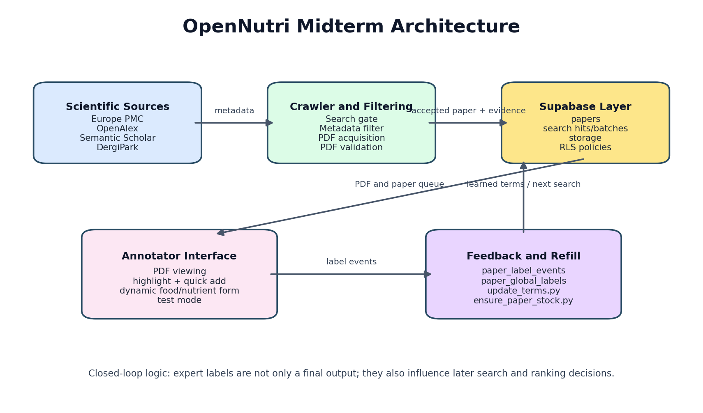
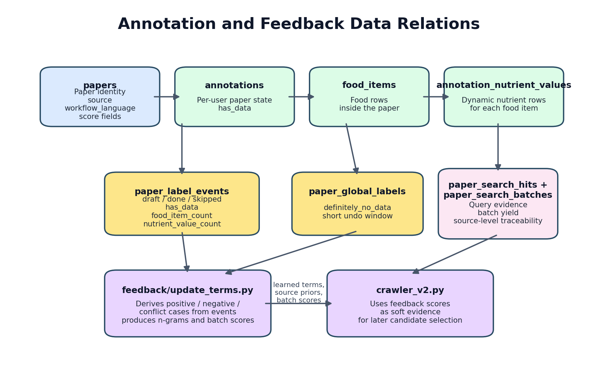
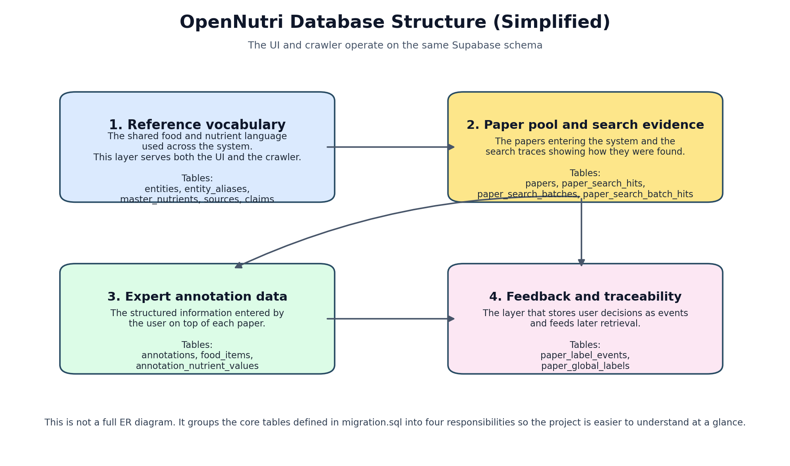
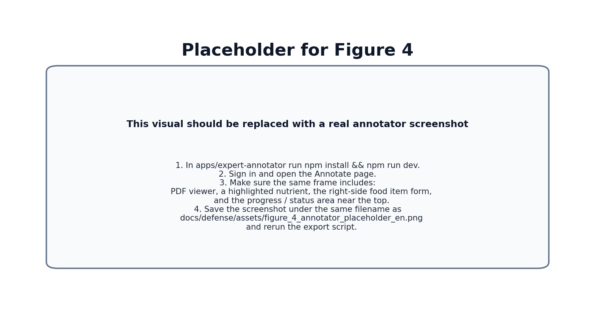
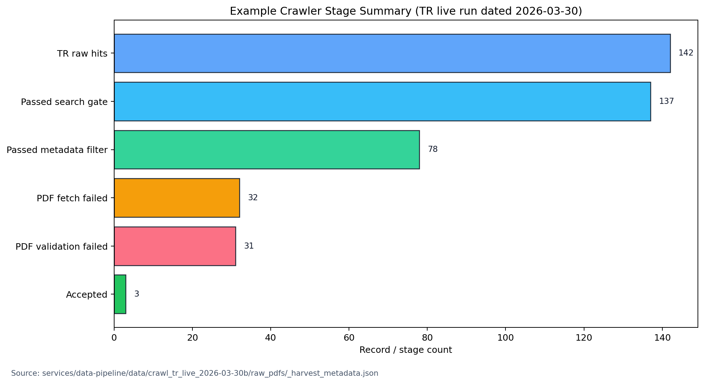

# SOFTWARE ENGINEERING PRACTICE-I
## MIDTERM REPORT

### OpenNutri: LLM-Assisted Extraction of Food Data from Scientific Literature

**Students:**

- 221229078 - Arciel Aliognis Baez Zamora
- 221229075 - Duc Huan Ngo
- 221229031 - Ayşegül Doğan

**Advisor:** Dr. Öğr. Üyesi Fatma Zehra Solak

**Exam Date:** [To be filled by the advisor]

\newpage

# SUMMARY OF WORK COMPLETED DURING THE TERM

This midterm report summarizes the current state of the first three work items defined for the first semester in the project proposal:

- automated data acquisition pipeline,
- database and orchestration architecture,
- expert annotation engine.

By the midterm stage, OpenNutri has a working core system. The crawler collects metadata from Europe PMC, OpenAlex, Semantic Scholar, and DergiPark; passes candidates through staged relevance checks; imports suitable PDFs into the Supabase layer; and hands those papers to the annotator interface. The annotator opens the paper on top of the PDF, stores food-item and nutrient entries, and turns user decisions into feedback signals for later runs.

Three technical decisions define this stage. First, the system performs strong pre-filtering before PDF download, so expert time is spent on stronger candidates. Second, English and Turkish literature are managed as separate target pools, which places Turkish studies inside the direct target scope. Third, expert annotation is part of a closed loop: user decisions become signals that improve later crawler runs.

Table 1 summarizes how the current system state maps to the first-semester proposal items.

| Proposal item | Midterm status | Concrete output |
| --- | --- | --- |
| 1. Automated Data Acquisition Pipeline | Substantially progressed | Multi-source search, language-scoped workflows, PDF acquisition, validation, upload to Supabase |
| 2. Database and Orchestration Architecture | Substantially progressed | Shared schema, RLS policies, storage path, ETL and search-evidence tables |
| 3. Expert Annotation Engine | Substantially progressed | PDF viewing, nutrient highlighting, dynamic food/nutrient entry, test mode, global skip, event logging |
| 4. Document Segmentation and Core Extraction Process | Next phase | This report focuses on the first three working items |

Table 2 summarizes the main parts of the running system and the role of each part.

| Layer | Capabilities running at this stage | Role in the project |
| --- | --- | --- |
| Crawler and paper acquisition | Multi-source search, multi-stage filtering, EN/TR workflows, DergiPark support, PDF validation | Moves more selective and traceable papers into the annotator queue |
| Backend and data model | Shared database schema, search-evidence records, annotation tables, RLS policies | Keeps the UI, crawler, and feedback layer on the same data contract |
| Annotator and user workflow | PDF viewing, highlight-assisted entry, dynamic food/nutrient form, test mode, global skip | Lets the expert user work directly on the document in a controlled way |
| Learning feedback loop | Event logging, global labels, feedback terms, query-batch signals | Converts user decisions into later search and ranking signals |

Figure 1 shows the end-to-end system state available at the midterm stage.

Figure 1. Closed-loop OpenNutri architecture implemented by the midterm stage.

The midterm output is a working core data flow. Paper acquisition, annotation storage, and the feedback chain already operate on the same infrastructure.

\newpage

# PROJECT OBJECTIVE AND IMPORTANCE

## Project Objective

The objective of OpenNutri is to build a platform that turns food-composition data scattered across scientific literature into structured records while preserving the link to the source paper. To achieve that goal, the project establishes three capabilities:

- automatically finding relevant papers and bringing them into the system,
- allowing experts to annotate those papers in a controlled way,
- using the resulting labels to improve later retrieval and ranking decisions.

At the midterm stage, the focus is to make the core version of this structure run end to end. The current work establishes the data infrastructure, user workflow, and feedback loop in the same system.

## Project Importance

The importance of the project starts with the data-access problem. Food-composition knowledge is published in thousands of PDFs, but it rarely exists as structured, queryable, source-linked data. OpenNutri targets that gap directly.

This need is especially visible in Turkish literature. Many studies published in Turkey remain inside DergiPark and similar archives without becoming part of standard international food-data infrastructure. As a result, local foods, local varieties, and Turkish-language studies remain underrepresented in digital food-data infrastructure. The EN/TR workflow split is therefore a scope decision with direct technical consequences.

The second major point is expert efficiency. Expert annotation is expensive and limited. OpenNutri combines retrieval, pre-filtering, PDF validation, and feedback so stronger candidates reach the expert user, and expert decisions improve the next run.

In the longer term, this approach can support researchers, health-tech products, public institutions, and export-oriented producers through a domestic data infrastructure. By the midterm stage, the technical foundation for that goal is already in place.

\newpage

# LITERATURE REVIEW

The literature review examined both food-data standards and scientific-document processing tools. It covered academic papers, databases, open-access archives, ontologies, and the software ecosystems used in the implementation.

## 1. Food data and reference vocabularies

OpenNutri’s data model is built around a shared vocabulary. FoodData Central [1] and the FAO/INFOODS matching approach [2] were reviewed, and canonical foods and canonical nutrients were treated as separate concepts. This supports the use of the same vocabulary across annotation and retrieval tasks.

Ontology-centered work such as FoodOn [3] is relevant for standardizing food names. Such ontologies make clear why different names from different sources must be mapped onto shared concepts.

## 2. Scientific literature sources

PubMed Central [4] and Europe PMC [5] were evaluated as core external sources because they provide structured access to open-access biomedical and life-science literature. DergiPark [6] is especially important for reaching Turkish-language studies. Taken together, these sources show the need to handle international and local literature in the same system while respecting different language and source characteristics.

## 3. Human-in-the-loop learning approach

Human-in-the-loop methodology [7] keeps the expert user as an active part of extraction and verification. It supports treating expert decisions not only as final labels but also as feedback signals that can be reused later.

## 4. PDF processing and UI infrastructure

Because article content is usually distributed as PDF, in-browser PDF processing became essential. PDF.js [8] and React [9] were evaluated together. In literature-annotation settings, the fragmented PDF text layer makes highlighting, selection, and text matching important problems in addition to basic rendering.

## 5. Platform components used in the implementation

Supabase [10] was evaluated because it combines authentication, row-level access control, file storage, and client access in one platform. Platforms of this kind are suitable for systems where the user interface and the data pipeline share the same backend.

Taken together, this literature and platform review explains why the problem domain calls for a shared vocabulary, multi-source access, expert annotation on top of PDFs, and a human-in-the-loop verification model.

\newpage

# MATERIALS AND METHODS

## 1. Overall system approach

The midterm version of OpenNutri consists of three major layers:

- the user-facing annotator interface,
- the shared backend and data model,
- the multi-source crawler and feedback layer.

Four engineering choices define the current implementation: separating paper discovery from PDF acquisition, using a shared vocabulary and shared database, building annotation around a dynamic row model, and storing user decisions as event-based feedback. The following subsections focus on how that structure works rather than listing tools in isolation.

The interaction of these layers was shown in Figure 1. Figure 2 expands that view by focusing on the internal data-model and feedback relationships.

Figure 2. Data-model relationships linking annotation, event logging, and crawler feedback in the midterm system.

## 2. Materials used

This version is built around two connected technical clusters. On the user side, a React 19 + Vite web interface works together with PDF.js and react-pdf so that PDF viewing, highlighting, and structured entry happen on the same screen. On the backend side, Supabase brings authentication, PostgreSQL, and file storage into the same application layer.

The acquisition and feedback pipeline is implemented in Python. Europe PMC, PubMed Central, OpenAlex, Semantic Scholar, and DergiPark are used as paper sources, while USDA FoodData Central [1] is used as the reference data source. Metadata-level semantic suitability is supported by a dual English + multilingual embedding setup based on sentence-transformers.

## 3. Backend and data-model method

The main backend decision was to organize the system around one shared data model. That model can be understood through four parts: the shared food/nutrient vocabulary, the papers and search evidence entering the system, the expert annotation records, and the event logs that preserve user decisions as feedback.

This structure keeps the UI, crawler, and feedback logic on the same data model. The names used in the UI and the terms reused by the crawler rely on the same reference vocabulary. The reason a paper entered the system and the later annotation built on top of it are tied to the same paper record.

Figure 3 presents a simplified database summary derived from the active Supabase schema.

Figure 3. Simplified view of the main database structure used in the midterm system, grouped into four responsibilities so the project is easier to understand. The summary is derived from the active Supabase schema.

Row-level security (RLS) is used to protect the backend. Users can manage their own annotation data, while the service role remains able to perform crawler uploads, ETL, and maintenance operations. This is the core security mechanism required by the system’s multi-user design.

## 4. Annotator interface method

The annotator interface is designed as a working screen where the expert can read a paper and enter structured data at the same time. The user opens a paper from the system queue, sees any previously saved work, and continues from the last meaningful state.

The interface follows two principles. The user can add as many food items and nutrient values as the paper requires. The PDF and the form are presented in the same working screen so the user can read the document and move quickly into structured entry. In practice, this gives the expert user a document-based verification role.

Three interface behaviors are especially important:

- a `test mode` that allows safe use of the full UI without writing to the real database,
- a `global skip` action that marks a paper as containing no relevant data for all users, with a short undo window,
- counting only valid food items so empty placeholder cards do not affect saved totals.

Figure 4 is the placeholder for the final annotator UI screenshot.

Figure 4. Before final submission, this visual should be replaced with a real screenshot of the current annotator interface. The image should include the PDF viewer, an example highlighted nutrient, the food-item form, and the progress/status area in the same frame.

## 5. Crawler, filtering, and acquisition method

The crawler is built as a staged selection pipeline. The basic approach has three steps:

- **Search:** finding metadata-level candidates from sources such as Europe PMC, OpenAlex, Semantic Scholar, and DergiPark
- **Filter:** applying a `search gate`, meaning the first eligibility threshold, and a `metadata filter`, meaning the more detailed relevance screen over titles and abstracts
- **Acquisition:** downloading PDFs and validating full text only for sufficiently strong candidates

This separation is the main efficiency decision on the crawler side. It reduces unnecessary PDF downloads and moves fewer, stronger candidates into full-text acquisition.

The filtering stage combines three signal groups: domain-specific keyword and unit clues, semantic suitability based on embeddings, and feedback signals learned from previous user behavior.

Two crawler capabilities are especially important at this stage: separate target pools for English and Turkish literature, and feedback reuse at both term and `query batch` level, where a query batch is a bounded search run executed under the same query composition.

Figure 5 shows the numeric summary produced by the crawler's staged flow.

Figure 5. Stage counts derived from the manifest summary of a representative Turkish live run.

For Turkish-language acquisition, the DergiPark integration was also redesigned. Instead of a broad and weakly controlled search approach, the crawler now uses renewable journal- and issue-level local index files. This improves both source quality and traceability for Turkish literature.

## 6. Feedback and paper-stock refill method

The feedback update script reads the `event log`, the chronological record of save and skip decisions, and turns it into learning signals. Cases with meaningful saved data are treated as positive. Papers that clearly contain no relevant data or are repeatedly skipped are treated as negative. Mixed cases are kept out of training.

User decisions are reused as soft scoring signals in later crawler runs.

When the end-user paper pool becomes too small, the paper-stock refill script takes over. This script checks the current EN/TR paper counts, refreshes feedback when needed, refreshes the DergiPark index, runs the crawler, and uploads the results to Supabase. That creates an operational bridge between the annotation interface and the data-acquisition layer.

## 7. Midterm scope boundary

This report focuses on the first three working semester goals and the data/feedback infrastructure supporting them. Document segmentation and the LLM-based extraction process are deferred to the second semester.

The annotator screenshot is still left as a placeholder in this report. It should be replaced with the latest UI state before final submission.

\newpage

# REFERENCES

1. U.S. Department of Agriculture. *FoodData Central*. Available at: https://fdc.nal.usda.gov/ (Accessed: April 2, 2026).
2. FAO/INFOODS. *Guidelines for Food Matching*. Rome: Food and Agriculture Organization of the United Nations; 2012.
3. Dooley DM, Griffiths EJ, Gosal GS, et al. FoodOn: a harmonized food ontology to increase global food traceability, quality control and data integration. *npj Science of Food*. 2018;2(1):23.
4. National Center for Biotechnology Information. *PubMed Central (PMC)*. Available at: https://pmc.ncbi.nlm.nih.gov/ (Accessed: April 2, 2026).
5. Europe PMC. *Europe PMC*. Available at: https://europepmc.org/ (Accessed: April 2, 2026).
6. DergiPark Akademik. *DergiPark Akademik*. Available at: https://dergipark.org.tr/ (Accessed: April 2, 2026).
7. Monarch RM. *Human-in-the-Loop Machine Learning*. Manning Publications; 2021.
8. Mozilla. *PDF.js*. Available at: https://mozilla.github.io/pdf.js/ (Accessed: April 2, 2026).
9. React. *React Documentation*. Available at: https://react.dev/ (Accessed: April 2, 2026).
10. Supabase. *Supabase Documentation*. Available at: https://supabase.com/docs (Accessed: April 2, 2026).
