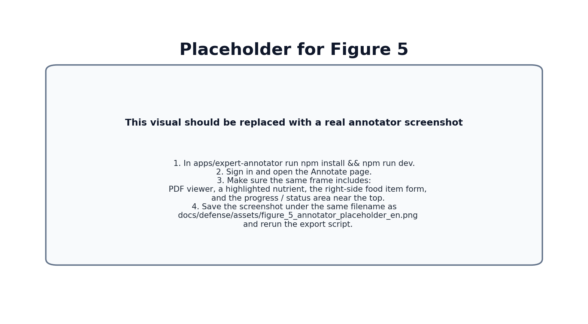

# SOFTWARE ENGINEERING PRACTICE-I
## MIDTERM REPORT

### OpenNutri: LLM-Assisted Extraction of Food Data from Scientific Literature

**Students:**

- 221229078 - Arciel Aliognis Baez Zamora
- 221229075 - Duc Huan Ngo
- 221229031 - Ayşegül Doğan

**Advisor:** Dr. Öğr. Üyesi Fatma Zehra Solak

**Exam Date:** [To be filled by the advisor]

\newpage

# SUMMARY OF WORK COMPLETED DURING THE TERM

This midterm report summarizes the current state of the first three work items defined for the first semester in the project proposal:

- automated data acquisition pipeline,
- database and orchestration architecture,
- expert annotation engine.

By the midterm stage, the team has moved beyond a purely conceptual design and delivered a working system core. At this point OpenNutri already has an infrastructure that can discover candidate papers from scientific sources, filter them through multiple stages, transfer suitable PDF files into the system, let an expert user create structured annotations on those papers, and feed those annotation outcomes back into later crawling decisions.

These outputs do not exist as disconnected modules. The core project idea is simple: the system first finds promising papers, the expert user reviews them and enters structured data, and those user decisions then improve the next search cycle. By the midterm stage, the core pieces of that loop are already working together.

Table 1 summarizes how the current system state maps to the first-semester proposal items.

| Proposal item | Midterm status | Concrete output |
| --- | --- | --- |
| 1. Automated Data Acquisition Pipeline | Substantially progressed | Multi-source search, language-scoped workflows, PDF acquisition, validation, upload to Supabase |
| 2. Database and Orchestration Architecture | Substantially progressed | Shared schema, RLS policies, storage path, ETL and search-evidence tables |
| 3. Expert Annotation Engine | Substantially progressed | PDF viewing, nutrient highlighting, dynamic food/nutrient entry, test mode, global skip, event logging |
| 4. Document Segmentation and Core Extraction Process | Outside the scope of this report | A production-ready extraction pipeline is not claimed as completed yet |

The system can be explained through four main ideas. First, the crawler should not send random papers into the system; it should choose stronger candidates first. Second, both the UI and the crawler should work on the same backend and data model. Third, the expert user needs an annotation screen that supports real work on top of the PDF itself. Fourth, user decisions should not remain a passive record; they should become feedback for later search and ranking.

For that reason, the report focuses on the working system idea rather than the commit-by-commit sequence. Table 2 is therefore organized around the main system parts instead of dates.

| Layer | Work completed | Technical result |
| --- | --- | --- |
| Crawler and paper acquisition | Multi-source search, multi-stage filtering, EN/TR workflows, DergiPark support, PDF validation | Papers entering the system became more selective and more meaningful |
| Backend and data model | Shared database schema, search-evidence records, annotation tables, RLS policies | The UI, crawler, and feedback layer now operate on the same data structure |
| Annotator and user workflow | PDF viewing, highlight-assisted entry, dynamic food/nutrient form, test mode, global skip | Expert users can work on real documents faster and with better control |
| Learning feedback loop | Storing user decisions as events and reusing them in later retrieval | The system moved toward a real closed loop that learns from user behavior |

Figure 1 shows the end-to-end system state available at the midterm stage.

Figure 1. Closed-loop OpenNutri architecture implemented by the midterm stage.

The key point to emphasize here is that the project has not yet completed every item in the proposal, but the first three goals are no longer only planned. They already exist as working system components. For that reason, the current stage should be evaluated not as a vague middle ground between "design document" and "finished product," but as an early production-stage system whose core infrastructure is already operating in practice.

\newpage

# PROJECT OBJECTIVE and IMPORTANCE

## Project Objective

The objective of OpenNutri is to develop a platform that digitizes food-composition data scattered across scientific literature without removing human expertise from the loop; instead, expert feedback is treated as a central component of the system. To achieve that goal, the project aims to establish three capabilities at the same time:

- automatically finding relevant papers and bringing them into the system,
- allowing experts to annotate those papers in a controlled way,
- using the resulting labels to improve later retrieval and ranking decisions.

At the midterm stage, the focus is to build the core version of these three capabilities in line with the first-semester goals. Accordingly, the current work does not claim that a full LLM-based extraction system has already been completed. Instead, it focuses on building the data and user infrastructure that such a system could later rely on for training and validation.

## Project Importance

The importance of the project appears at three levels.

The first level is the data-access problem. Food-composition studies are usually published as PDF documents, distributed across different journal infrastructures, and often lack any standard machine-readable output format. In other words, the information exists, but it cannot be used directly as queryable structured data. OpenNutri targets this gap.

The second level is efficient use of expert time. Expert annotation is expensive and limited. If irrelevant papers reach the annotator queue, expert effort is wasted. For this reason, the project is not only about building a UI; it also tries to improve what reaches the expert by combining the crawler and feedback layers. At the midterm stage, the implemented search gate, metadata filter, PDF validation, and global skip logic directly support this goal.

The third level is the visibility of Turkish literature. The proposal explicitly targets PubMed and DergiPark. This choice is deliberate. PubMed Central provides access to international open-access literature, while DergiPark gives access to many studies published in Turkey. The shift toward language-scoped EN/TR workflows is therefore important because Turkish studies are no longer treated as a side effect; they are treated as a distinct target pool.

From a technical point of view, the project is important not because it uses a single advanced algorithm, but because it combines a normalized data model, multi-source search, layered filtering, PDF validation, user-event logging, and soft feedback learning in one system. This integrated approach goes beyond a conventional CRUD application and creates a strong base for later document segmentation and LLM-based extraction work.

\newpage

# LITERATURE REVIEW

The project was designed by examining both food-data standards and scientific-document processing tools together. The literature review therefore did not rely only on academic papers; it also considered databases, open-access archives, ontologies, and the software ecosystems used in the implementation.

## 1. Food data and reference vocabularies

OpenNutri’s data model was not built directly on free-text labels. FoodData Central [1] and the FAO/INFOODS matching approach [2] were reviewed, and the concepts of canonical foods and canonical nutrients were modeled as separate tables. As a result, the food and nutrient choices visible in the UI are tied to a shared vocabulary that can later be reused both for crawler term generation and for validating any future LLM extraction outputs.

Ontology-centered work such as FoodOn [3] is also relevant, especially for standardizing food names. The current project version does not implement a full ontology integration, but the decision to use `entities` and `entity_aliases` was motivated by the same need for controlled standardization.

## 2. Scientific literature sources

PubMed Central [4] and Europe PMC [5] were evaluated as core external sources because they provide structured access to open-access biomedical and life-science literature. DergiPark [6] was included specifically to reach Turkish-language studies. During the midterm period, the DergiPark path was redesigned from a simple broad search approach into a renewable local journal/issue/article index. That change made Turkish-language crawling more controlled and auditable.

## 3. Human-in-the-loop learning approach

The project intentionally avoids fully automating every decision. Human-in-the-loop methodology [7] argues that experts should remain an active part of scientific extraction and verification workflows. In OpenNutri, this idea becomes concrete through the annotator UI and `paper_label_events`. User actions such as `draft`, `done`, `skipped`, and global `definitely_no_data` are not just interface interactions; they also become feedback signals that influence later crawling.

## 4. PDF processing and UI infrastructure

Because article content is usually distributed as PDF, in-browser PDF processing became essential. PDF.js [8] and React [9] were therefore evaluated together. However, the PDF problem is not limited to rendering. Since the PDF text layer is fragmented across spans, the nutrient-highlighting feature required additional scanning, overlap resolution, and click-recovery logic. This highlights an important difference between literature-annotation tools and ordinary web forms.

## 5. Platform components used in the implementation

Supabase [10] was evaluated not merely as a database, but as a single platform layer providing authentication, row-level access control, file storage, and client access. At the midterm stage both the annotator and the data pipeline already share this backend. This choice was meaningful both for data consistency and for fast prototyping.

The literature review led to several engineering decisions:

- not combining paper discovery and PDF download into a single step,
- designing the UI with a dynamic row model instead of fixed nutrient columns,
- storing labels as event history rather than only a final state,
- handling Turkish and English sources under the same system but with separate targets,
- using feedback as a soft score instead of a hard rejection rule.

All of these decisions are already reflected in the current codebase, which means the project has moved from a theoretical design into an implemented system behavior.

\newpage

# MATERIALS AND METHODS

## 1. Overall system approach

The midterm version of OpenNutri consists of three major layers:

- the user-facing annotator interface,
- the shared backend and data model,
- the multi-source crawler and feedback layer.

The interaction of these layers was shown in Figure 1. Figure 2 expands that view by focusing on the internal data-model and feedback relationships.

Figure 2. Data-model relationships linking annotation, event logging, and crawler feedback in the midterm system.

## 2. Materials used

The main technical materials used in the project are:

- **Frontend framework:** React 19 + Vite
- **Backend and storage:** Supabase Auth, PostgreSQL, Storage
- **PDF handling:** `react-pdf` and PDF.js
- **Data-pipeline language:** Python
- **Reference data source:** USDA FoodData Central [1]
- **Paper sources:** Europe PMC [5], PubMed Central [4], OpenAlex, Semantic Scholar, DergiPark [6]
- **Embedding layer:** a dual English + multilingual setup based on `sentence-transformers`

These components are used across two connected sides of the project: the web application that manages expert workflow and the data pipeline that feeds the paper queue.

## 3. Backend and data-model method

The main backend decision was to organize the system around one shared data model. That model can be understood through four parts: the shared food/nutrient vocabulary, the papers and search evidence entering the system, the expert annotation records, and the event logs that preserve user decisions as feedback.

The point of this structure is not only storage. It allows the UI, crawler, and feedback logic to stay connected instead of becoming separate tools. For example, the names used in the user interface and the terms reused by the crawler rely on the same reference vocabulary, while the reason a paper entered the system and the later annotation built on top of it are tied to the same paper record.

Figure 3 presents a simplified database summary derived from `apps/expert-annotator/migration.sql`, which is the code-level source of truth for the active Supabase schema.

Figure 3. Simplified view of the main database structure used in the midterm system, grouped into four responsibilities so the project is easier to understand. The summary is derived from the current `migration.sql` schema definition.

Row-level security (RLS) is used to protect the backend. Users can manage their own annotation data, while the service role remains able to perform crawler uploads, ETL, and maintenance operations. This is the core security mechanism required by the system’s multi-user design.

## 4. Annotator interface method

The annotator interface is designed as a working screen where the expert can read a paper and enter structured data at the same time. The user opens a paper from the system queue, sees any previously saved work, and continues from the last meaningful state.

Two ideas define the interface. First, data entry is not restricted to fixed columns; the user can add as many food items and nutrient values as the paper requires. Second, the PDF and the form are not disconnected; the user can read the document and move more quickly into structured entry when relevant nutrient content is detected.

Three interface behaviors are especially important:

- a test mode that allows safe use of the full UI without writing to the real database,
- a global "definitely no data" action with a short undo window,
- counting only valid food items so that empty placeholder cards do not create incorrect `food_item_count` values.

Figure 4 was added to show that the crawler now produces a measurable staged flow.

Figure 4. Stage counts derived from the manifest summary of a representative Turkish live run. This figure is not presented as a benchmark; it is included to show that the pipeline already produces measurable staged behavior.

For the real annotator UI screenshot, Figure 5 is intentionally left as a placeholder.

Figure 5. Before final submission, this visual should be replaced with a real screenshot of the current annotator interface. The simplest approach is to replace `docs/defense/assets/figure_5_annotator_placeholder_en.png` with the screenshot under the same filename and rerun the export script. The image should include the PDF viewer, an example highlighted nutrient, the food-item form, and the progress/status area in the same frame.

## 5. Crawler, filtering, and acquisition method

The crawler was not designed as a one-step search script. Instead, it was built as a staged selection pipeline. The basic approach has three steps:

- **Search:** finding metadata-level candidates from sources such as Europe PMC, OpenAlex, Semantic Scholar, and DergiPark
- **Filter:** applying search-gate and metadata-filter logic to titles and abstracts
- **Acquisition:** downloading PDFs and validating full text only for sufficiently strong candidates

This separation is an important engineering decision. Downloading every candidate PDF would be both expensive and unnecessary. The pre-filtering step allows fewer but stronger candidates to move into full-text acquisition.

The filtering stage does not rely on a single rule. Instead, it combines three broader signal groups: domain-specific keyword and unit clues, semantic suitability based on embeddings, and feedback signals learned from previous user behavior. This makes the system more robust than a simple keyword matcher.

Two crawler capabilities are especially important at this stage. First, English and Turkish literature are handled as separate target pools. Second, user feedback is reused not only at the term level but also at the query-batch level.

For Turkish-language acquisition, the DergiPark integration was also redesigned. Instead of a broad and weakly controlled search approach, the crawler now uses renewable journal- and issue-level local index files. This improves both source quality and traceability for Turkish literature.

## 6. Feedback and paper-stock refill method

The `feedback/update_terms.py` script reads the user-created event records and turns them into learning signals. The idea is straightforward: if the user found and saved meaningful data, that case is treated as positive; if the paper clearly contains no relevant data or is repeatedly skipped, it is treated as negative; and if the evidence is mixed, it is kept out of training.

The resulting feedback is then consumed by the crawler as a soft scoring signal. In other words, the system does not treat feedback as a rigid veto. It converts user experience into a more balanced ranking signal for later retrieval.

When the end-user paper pool becomes too small, `ensure_paper_stock.py` takes over. This script checks the current EN/TR paper counts, refreshes feedback when needed, refreshes the DergiPark index, runs the crawler, and uploads the results to Supabase. That creates an operational bridge between the annotation interface and the data-acquisition layer.

## 7. Current limitations

At the midterm stage, proposal item four, document segmentation and an LLM-based core extraction process, is not presented as a completed production pipeline. The repository contains exploratory and prototype-level files in that direction, but this report is intentionally limited to the first three working semester goals and the data/feedback infrastructure supporting them.

Similarly, the real annotator screenshot is still left as a placeholder in this report. The reason is practical: it is better to capture the most up-to-date UI state close to final submission.

\newpage

# REFERENCES

1. U.S. Department of Agriculture. FoodData Central. https://fdc.nal.usda.gov/
2. FAO/INFOODS. Guidelines for Food Matching. Rome: Food and Agriculture Organization of the United Nations, 2012.
3. Dooley DM, Griffiths EJ, Gosal GS, et al. FoodOn: a harmonized food ontology to increase global food traceability, quality control and data integration. *npj Science of Food*. 2018;2(1):23.
4. National Center for Biotechnology Information. PubMed Central (PMC). https://pmc.ncbi.nlm.nih.gov/
5. Europe PMC. https://europepmc.org/
6. DergiPark Akademik. https://dergipark.org.tr/
7. Monarch RM. *Human-in-the-Loop Machine Learning*. Manning Publications; 2021.
8. Mozilla. PDF.js. https://mozilla.github.io/pdf.js/
9. React Documentation. https://react.dev/
10. Supabase Documentation. https://supabase.com/docs
