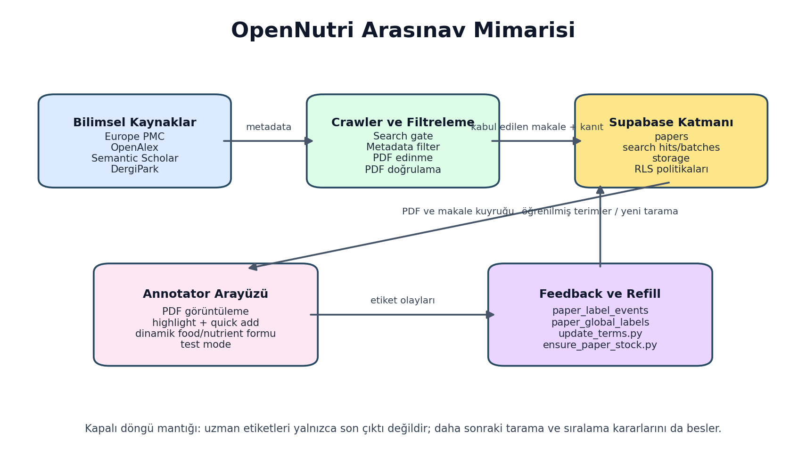
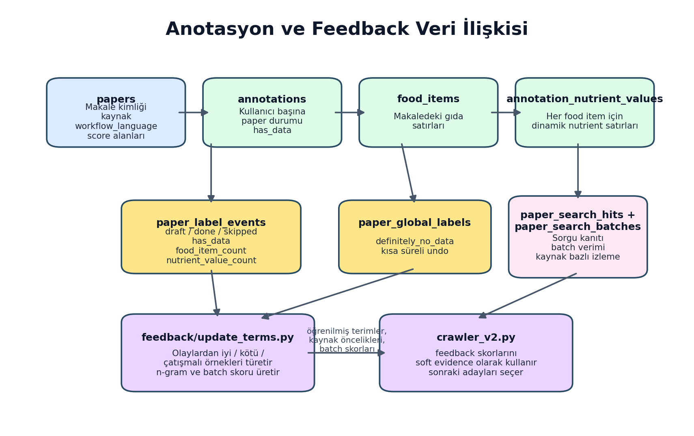
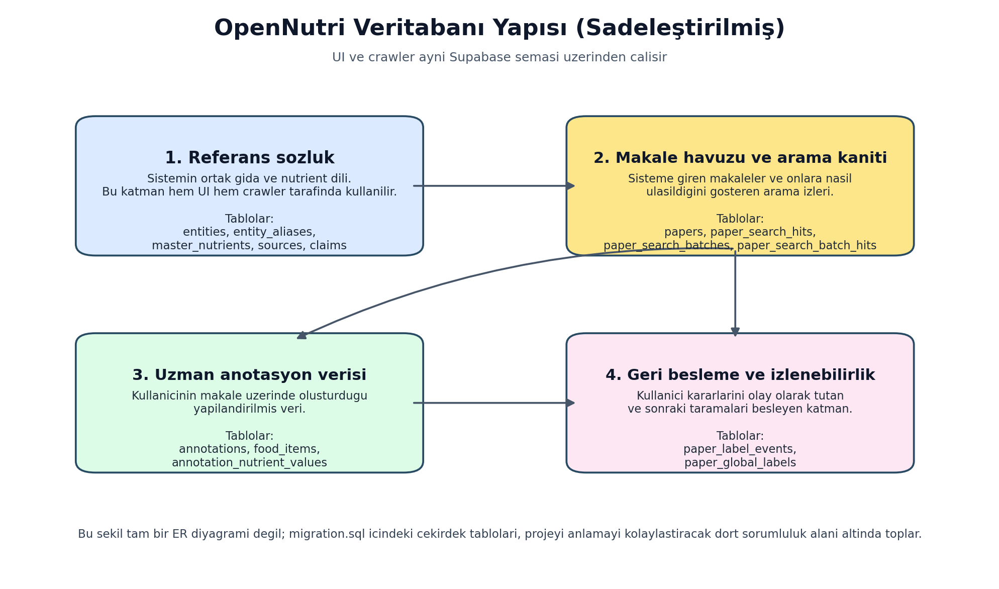
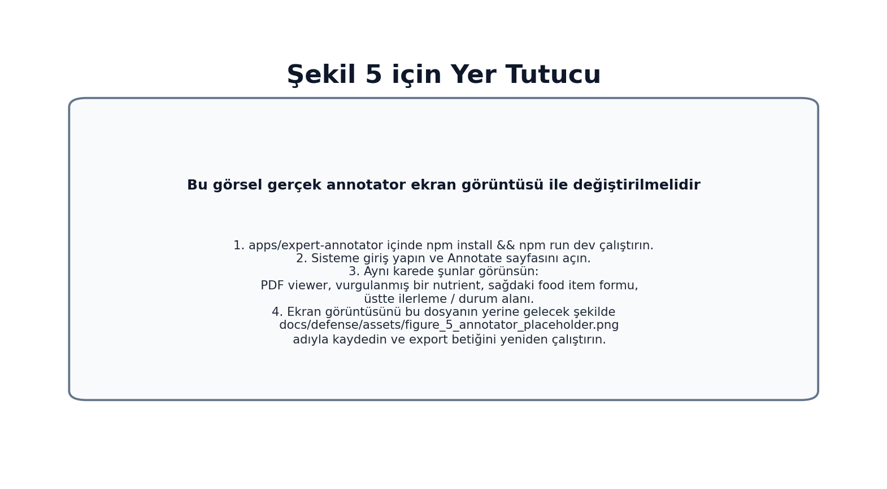

# YAZILIM MÜHENDİSLİĞİ UYGULAMASI-I
## ARASINAV RAPORU

### OpenNutri: Bilimsel Literatürden LLM Destekli Gıda Verisi Çıkarımı

**Öğrenciler:**

- 221229078 - Arciel Aliognis Baez Zamora
- 221229075 - Duc Huan Ngo
- 221229031 - Ayşegül Doğan

**Danışman:** Dr. Öğr. Üyesi Fatma Zehra Solak

**Sınav Tarihi:** [Danışman tarafından doldurulacaktır]

\newpage

# DÖNEM İÇİ YAPILAN ÇALIŞMALARIN ÖZETİ

Bu ara rapor, proje öneri formunda birinci dönem için tanımlanan ilk üç ana başlığın mevcut durumunu özetlemektedir:

- otomatik veri alma boru hattı,
- veritabanı ve orkestrasyon mimarisi,
- uzman anotasyon motoru.

Arasınav itibarıyla ekip, projenin yalnızca teorik tasarımını değil, birlikte çalışan gerçek bir sistem çekirdeğini ortaya çıkarmıştır. Mevcut durumda OpenNutri; bilimsel kaynaklardan aday makale bulabilen, bunları çok aşamalı olarak filtreleyebilen, uygun PDF dosyalarını sisteme aktarabilen, uzman kullanıcının bu makaleler üzerinde yapılandırılmış anotasyon yapmasını sağlayan ve oluşan etiketleri daha sonraki tarama kararlarına geri besleme olarak kullanabilen bir altyapıya sahiptir.

Bu çıktılar birbirinden kopuk modüller değildir. Projenin temel fikri basittir: sistem önce uygun makaleleri bulur, uzman kullanıcı bu makaleleri inceler ve yapılandırılmış veri girer, ardından bu kullanıcı kararları bir sonraki tarama döngüsünü iyileştirir. Arasınav itibarıyla bu döngünün çekirdek parçaları birlikte çalışır hale gelmiştir.

Birinci dönem maddeleri ile mevcut durumun ilişkisi Tablo 1'de özetlenmiştir.

| Öneri formu maddesi | Arasınav durumu | Somut çıktı |
| --- | --- | --- |
| 1. Otomatik Veri Alma Boru Hattı | Büyük ölçüde ilerletildi | Çok kaynaklı tarama, dil bazlı iş akışları, PDF edinme, doğrulama, Supabase'e yükleme |
| 2. Veritabanı ve Orkestrasyon Mimarisi | Büyük ölçüde ilerletildi | Ortak şema, RLS politikaları, depolama hattı, ETL ve arama kanıtı tabloları |
| 3. Uzman Anotasyon Motoru | Büyük ölçüde ilerletildi | PDF görüntüleme, nutrient highlight, dinamik food/nutrient girişi, test mode, global skip, olay kaydı |
| 4. Belge Segmentasyonu ve Temel Çıkarım Süreci | Bu rapor kapsamı dışında | Üretim düzeyinde tamamlanmış bir çıkarım hattı henüz sunulmamaktadır |

Bu sistem dört temel fikir etrafında şekillenmiştir. Birincisi, sisteme rastgele makale sokmak yerine önce güçlü adayları seçen bir crawler hattı kurmaktır. İkincisi, hem arayüzün hem de crawler'ın aynı backend ve veri modeli üzerinde çalışmasını sağlamaktır. Üçüncüsü, uzman kullanıcının PDF üzerinde rahat çalışabileceği bir anotasyon ekranı oluşturmaktır. Dördüncüsü ise kullanıcı kararlarını yalnızca kayıt olarak tutmayıp daha sonraki arama ve sıralama kararlarına geri besleme olarak kullanmaktır.

Bu nedenle bu raporda odak nokta tek tek commit adımları değil, dönem sonunda ortaya çıkan çalışan sistem fikridir. Tablo 2 de bu nedenle zaman çizelgesi yerine sistemin ana parçaları üzerinden düzenlenmiştir.

| Katman | Gerçekleştirilen işler | Teknik sonucu |
| --- | --- | --- |
| Crawler ve makale edinimi | Çok kaynaklı arama, çok aşamalı eleme, EN/TR iş akışları, DergiPark desteği, PDF doğrulama | Sisteme gelen makaleler daha seçilmiş ve daha anlamlı hale geldi |
| Backend ve veri modeli | Ortak veritabanı şeması, arama kanıtı kayıtları, anotasyon tabloları, RLS politikaları | UI, crawler ve geri besleme katmanı aynı veri yapısı üzerinde birleşti |
| Annotator ve kullanıcı iş akışı | PDF görüntüleme, highlight destekli veri girişi, dinamik food/nutrient formu, test mode, global skip | Uzman kullanıcı gerçek belge üzerinde daha hızlı ve kontrollü çalışabilir hale geldi |
| Öğrenen geri besleme döngüsü | Kullanıcı kararlarının event olarak saklanması ve sonraki taramayı beslemesi | Sistem kullanıcı davranışından öğrenen kapalı döngü yapısına yaklaştı |

Şekil 1, arasınav itibarıyla oluşan uçtan uca sistemi göstermektedir.

Şekil 1. OpenNutri'nin arasınav itibarıyla çalışan kapalı döngü mimarisi.

Bu noktada özellikle vurgulanması gereken husus şudur: proje henüz öneri formundaki bütün hedefleri tamamlamamıştır; ancak ilk üç hedef için yalnızca hazırlık değil, gerçek çalışan bileşenler geliştirilmiştir. Bu nedenle mevcut aşama, "tasarım dökümanı" ile "tamamlanmış ürün" arasındaki ara bir nokta değil, sistemin çekirdek altyapısının fiilen çalıştığı erken üretim aşaması olarak değerlendirilebilir.

\newpage

# PROJENİN AMACI ve ÖNEMİ

## Projenin Amacı

OpenNutri'nin amacı, bilimsel literatürde dağınık halde bulunan gıda bileşimi verilerini insan uzmanlığını sistem dışına itmeden, aksine uzman geri bildirimini merkeze alarak dijitalleştiren bir platform geliştirmektir. Proje bu amacı gerçekleştirmek için üç temel yeteneği aynı anda kurmayı hedeflemektedir:

- uygun makaleleri otomatik olarak bulmak ve sisteme taşımak,
- bu makaleleri uzmanların denetimli biçimde etiketlemesini sağlamak,
- oluşan etiketlerden yararlanarak sonraki tarama kararlarını daha isabetli hale getirmek.

Arasınav aşamasında amaç, özellikle ilk dönem hedeflerine uygun biçimde bu üç yeteneğin çekirdek sürümünü ayağa kaldırmaktır. Buna göre mevcut çalışma, doğrudan LLM tabanlı tam çıkarım sistemini tamamlamaktan ziyade, o sistemi daha sonra güvenilir biçimde eğitip doğrulayabilecek veri ve kullanıcı altyapısını kurmaya odaklanmıştır.

## Projenin Önemi

Projenin önemi üç düzeyde ortaya çıkmaktadır.

Birinci düzey veri erişimi problemidir. Gıda bileşimiyle ilgili bilimsel çalışmalar çoğunlukla PDF biçiminde, farklı dergi altyapılarında ve çoğu zaman standart bir veri çıkış formatı olmadan yayımlanmaktadır. Bu nedenle bilgi vardır, ancak doğrudan sorgulanabilir veri olarak kullanılamaz. OpenNutri bu boşluğu doldurmayı hedeflemektedir.

İkinci düzey insan emeğinin verimli kullanılmasıdır. Uzman anotasyonu pahalı ve sınırlı bir kaynaktır. Eğer sisteme yanlış makaleler gelirse uzman zamanı boşa harcanır. Bu nedenle proje yalnızca bir arayüz yapmakla kalmamakta, crawler ve geri besleme katmanı ile uzman önüne daha anlamlı adaylar getirmeye çalışmaktadır. Arasınav itibarıyla geliştirilen search gate, metadata filter, PDF doğrulama ve global skip mantığı tam olarak bu ihtiyaca cevap vermektedir.

Üçüncü düzey Türkçe literatürün görünürlüğüdür. Proje öneri formunda açıkça PubMed ve DergiPark kaynakları hedeflenmiştir. Bu seçim tesadüf değildir. PubMed Central uluslararası açık erişim literatüre erişim sağlarken, DergiPark Türkiye'de yayımlanan birçok çalışmaya erişim sağlar. Dil bazlı EN/TR iş akışlarına geçilmiş olması, Türkçe çalışmaları yalnızca yan ürün olarak değil, ayrı bir hedef havuz olarak ele alma kararı açısından önemlidir.

Teknik açıdan bakıldığında projenin önemi yalnızca tek bir algoritma kullanmasından gelmez. OpenNutri; normalize edilmiş veri modeli, çok kaynaklı tarama, katmanlı filtreleme, PDF doğrulama, kullanıcı olay kaydı ve soft feedback öğrenmesini bir araya getirerek klasik bir CRUD uygulamasından daha ileri bir yapı kurmaktadır. Bu bütünleşik yaklaşım, ileride eklenecek belge segmentasyonu ve LLM tabanlı çıkarım katmanının sağlam bir temel üzerinde gelişmesini sağlayacaktır.

\newpage

# KAYNAK ARAŞTIRMASI

Proje tasarlanırken hem gıda verisi standartları hem de bilimsel makale işleme araçları birlikte incelenmiştir. Kaynak araştırması yalnızca akademik makalelerden oluşmamış; veri tabanları, açık erişim makale arşivleri, ontolojiler ve kullanılan yazılım ekosistemi de değerlendirilmiştir.

## 1. Gıda verisi ve referans sözlükleri

OpenNutri'nin veri modeli doğrudan serbest metin etiketleri üzerine kurulmamıştır. FoodData Central [1] ve FAO/INFOODS eşleme yaklaşımı [2] incelenerek canonical food ve canonical nutrient kavramları ayrı tablolar halinde modellenmiştir. Bu yaklaşım sayesinde kullanıcı arayüzünde görülen food ve nutrient seçimleri, daha sonra crawler terim üretiminde ve potansiyel LLM çıkarımının doğrulanmasında yeniden kullanılabilecek ortak bir sözlüğe bağlanmıştır.

FoodOn [3] gibi ontoloji tabanlı çalışmalar da özellikle gıda adlarının standartlaştırılması açısından önemlidir. Projenin mevcut sürümünde tam ontoloji entegrasyonu bulunmamaktadır; ancak `entities` ve `entity_aliases` yapısının seçilmesinde benzer bir standartlaştırma ihtiyacı gözetilmiştir.

## 2. Bilimsel literatür kaynakları

PubMed Central [4] ve Europe PMC [5], açık erişimli biyomedikal ve yaşam bilimleri literatürüne düzenli erişim sağladıkları için crawler hattının temel dış kaynakları olarak değerlendirilmiştir. DergiPark [6] ise özellikle Türkçe çalışmalara ulaşmak amacıyla projeye dahil edilmiştir. Arasınav döneminde DergiPark entegrasyonu basit bir genel arama mantığından çıkarılıp dergi-sayı-makale düzeyinde yenilenebilir yerel indeks mantığına taşınmıştır. Bu değişiklik, Türkçe kaynakların daha kontrollü taranmasını sağlamıştır.

## 3. İnsan-döngülü öğrenme yaklaşımı

Projede tüm kararların doğrudan otomasyona bırakılmaması bilinçli bir tercihtir. Human-in-the-loop yaklaşımı [7], özellikle bilimsel verilerin çıkarımı ve doğrulanmasında uzman kullanıcıyı sistemin aktif parçası haline getirmeyi önerir. OpenNutri'de bu fikir, annotator arayüzü ve `paper_label_events` ile somut hale gelmiştir. Kullanıcıların `draft`, `done`, `skipped` ve global `definitely_no_data` işlemleri sadece arayüz hareketi olarak kalmamakta; daha sonra crawler'a geri besleme olarak dönmektedir.

## 4. PDF işleme ve kullanıcı arayüzü altyapısı

Makale içerikleri çoğunlukla PDF olarak dağıtıldığı için tarayıcı içinde PDF işleme kritik hale gelmiştir. PDF.js [8] tabanlı görüntüleme ve React [9] tabanlı kullanıcı arayüzü birlikte değerlendirilmiştir. Ancak PDF işleme yalnızca görüntülemeyle sınırlı kalmamış, PDF metin katmanındaki parçalanmış span yapısı nedeniyle nutrient highlight özelliği için ek tarama ve çakışma çözüm mantıkları geliştirilmiştir. Bu durum, literatür tarama araçları ile klasik web formu arasındaki farkı açık biçimde göstermektedir.

## 5. Kullanılan platform bileşenleri

Supabase [10], proje için sadece bir veritabanı değil; kimlik doğrulama, satır düzeyi erişim kontrolü, dosya depolama ve istemci erişimi gibi ihtiyaçları tek bir altyapıda birleştiren platform olarak değerlendirilmiştir. Arasınav itibarıyla hem annotator hem de veri boru hattı aynı backend katmanını paylaşmaktadır. Bu tercih, veri tutarlılığı ve hızlı prototipleme açısından anlamlı bulunmuştur.

Kaynak araştırmasının çıktısı olarak şu mühendislik kararları alınmıştır:

- makale bulma ile PDF indirmeyi aynı adımda yapmamak,
- kullanıcı arayüzünü statik nutrient kolonları yerine dinamik satır modeliyle tasarlamak,
- etiketleri yalnızca son durum olarak değil, olay geçmişi olarak saklamak,
- Türkçe ve İngilizce kaynakları aynı mantık altında ama ayrı hedeflerle yönetmek,
- feedback bilgisini sert veto yerine yumuşak puan olarak kullanmak.

Bu kararların tamamı mevcut kod tabanında uygulanmış durumdadır ve projeyi salt teorik tasarımdan çıkarıp gerçek bir sistem davranışına taşımaktadır.

\newpage

# MATERYAL VE METOT

## 1. Genel sistem yaklaşımı

OpenNutri'nin arasınav sürümü üç ana katmandan oluşmaktadır:

- kullanıcıya görünen annotator arayüzü,
- ortak backend/veri modeli,
- çok kaynaklı crawler ve geri besleme katmanı.

Bu katmanların etkileşimi Şekil 1'de gösterilmişti. Şekil 2 ise bu akışın veri modeli ve geri besleme ilişkilerini daha ayrıntılı göstermektedir.

Şekil 2. Arasınav sürümünde anotasyon, olay kaydı ve crawler geri beslemesinin veri modeli içindeki ilişkisi.

## 2. Kullanılan materyaller

Projede kullanılan temel materyaller aşağıdaki gibidir:

- **Frontend çerçevesi:** React 19 + Vite
- **Backend ve depolama:** Supabase Auth, PostgreSQL, Storage
- **PDF işleme:** `react-pdf` ve PDF.js
- **Veri boru hattı dili:** Python
- **Referans veri kaynağı:** USDA FoodData Central [1]
- **Makale kaynakları:** Europe PMC [5], PubMed Central [4], OpenAlex, Semantic Scholar, DergiPark [6]
- **Embedding katmanı:** `sentence-transformers` tabanlı İngilizce + çok dilli ikili gömme yapısı

Bu bileşenler, gereksinimlere göre iki tarafta kullanılmıştır: kullanıcı iş akışını yöneten web uygulaması ve makale havuzunu besleyen veri boru hattı.

## 3. Backend ve veri modeli yöntemi

Backend tarafındaki temel karar, tüm sistemi tek bir ortak veri modeli etrafında toplamak olmuştur. Bu model dört ana parçadan oluşur: ortak gıda ve nutrient sözlüğü, sisteme alınan makaleler ve arama kanıtları, uzman anotasyon verisi ve kullanıcı kararlarını geri besleme olarak saklayan olay kayıtları.

Bu yaklaşımın amacı yalnızca veri saklamak değildir. Aynı yapı sayesinde arayüz, crawler ve geri besleme mantığı birbirinden kopmadan çalışabilmektedir. Örneğin kullanıcı arayüzünde seçilen gıda ve nutrient adları ile crawler tarafında kullanılan terim mantığı aynı referans sözlüğe dayanır; aynı şekilde bir makalenin neden sisteme girdiği ile kullanıcı üzerinde yapılan anotasyonlar da aynı makale kaydı etrafında birleşir.

Şekil 3, canlı Supabase yapısının kod içindeki kaynak karşılığı olan `apps/expert-annotator/migration.sql` temel alınarak hazırlanmış, sadeleştirilmiş bir veritabanı özeti sunmaktadır.

Şekil 3. Arasınav sürümündeki temel veritabanı yapısının, projeyi anlamayı kolaylaştıracak dört sorumluluk alanı altında özetlenmiş görünümü. Şema, `migration.sql` üzerinden sadeleştirilerek hazırlanmıştır.

Backend güvenliği için satır düzeyi güvenlik (RLS) kullanılmıştır. Kullanıcılar kendi anotasyonlarını yönetebilirken sistem servis rolü crawler yüklemeleri, ETL ve bakım işlemleri için geniş yetkiye sahiptir. Bu, çok kullanıcılı yapı için gerekli temel güvenlik önlemidir.

## 4. Annotator arayüzü yöntemi

Annotator arayüzü, uzman kullanıcının bir makaleyi okuyup aynı anda yapılandırılmış veri girebildiği çalışma ekranı olarak tasarlanmıştır. Kullanıcı sisteme alınmış makaleyi açar, varsa önceki kaydını görür ve çalışmasına kaldığı yerden devam eder.

Arayüzün merkezinde iki fikir vardır. Birincisi, veri girişinin sabit kolonlara bağlı olmamasıdır; kullanıcı gerektiği kadar food item ve her food item altında gerektiği kadar nutrient değeri ekleyebilir. İkincisi, PDF ile formun birbirinden kopuk olmamasıdır; kullanıcı belgeyi okurken ilgili nutrient ifadelerini görüp daha hızlı veri girişi yapabilir.

Bu bölümde özellikle üç davranış önemlidir:

- test mode ile gerçek veritabanına yazmadan güvenli deneme yapılabilmesi,
- global "definitely no data" işaretleme ve kısa süreli geri alma akışı,
- boş placeholder kartların yanlış `food_item_count` üretmemesi için yalnızca geçerli food item'ların sayılması.

Şekil 4, crawler hattının ölçülebilir bir aşamalı akış ürettiğini göstermek için eklenmiştir.

Şekil 4. Temsili bir Türkçe canlı koşunun manifest özetinden türetilen aşama sayıları. Bu şekil, sistemin ölçülebilir bir pipeline davranışı ürettiğini göstermek için eklenmiştir.

Arayüz ekranı için Şekil 5'te bir yer tutucu bırakılmıştır.

Şekil 5. Nihai teslimden önce bu görsel, çalışan annotator ekranının gerçek ekran görüntüsü ile değiştirilmelidir. En pratik yol, `docs/defense/assets/figure_5_annotator_placeholder.png` dosyasını gerçek ekran görüntüsü ile aynı ad altında değiştirip export betiğini yeniden çalıştırmaktır. Görselde PDF viewer, vurgulanmış nutrient örneği, food item formu ve ilerleme alanı aynı karede görünmelidir.

## 5. Crawler, filtreleme ve edinme yöntemi

Crawler tarafı tek adımlı bir arama betiği olarak değil, kademeli seçim yapan bir boru hattı olarak tasarlanmıştır. Temel yaklaşım üç aşamalıdır:

- **Search:** Europe PMC, OpenAlex, Semantic Scholar ve DergiPark gibi kaynaklardan metadata düzeyinde aday bulma
- **Filter:** Başlık ve özet üzerinde search gate ve metadata filter uygulama
- **Acquisition:** Ancak yeterince iyi bulunan adaylar için PDF indirme ve tam metin doğrulama

Bu ayrım önemli bir mühendislik kararıdır. Çünkü tüm adayların PDF'ini indirmek hem pahalı hem de gereksizdir. Ön eleme sayesinde daha az sayıda ama daha güçlü aday tam metin aşamasına geçmektedir.

Filtreleme aşamasında ayrıntılı kuralların hepsi tek tek kullanıcıya gösterilmemektedir; ancak mantık üç ana sinyal grubuna dayanır: konu ile doğrudan ilişkili kelime ve birim ipuçları, semantik benzerlik/embedding tabanlı uygunluk ve önceki kullanıcı etiketlerinden öğrenilen geri besleme sinyalleri. Böylece sistem tek bir kelime eşleşmesine değil, birden fazla işaretin birlikte değerlendirilmesine dayanır.

Crawler tarafında özellikle iki yetenek belirleyici hale gelmiştir. Birincisi, İngilizce ve Türkçe literatürün ayrı hedef havuzlar olarak yönetilmesidir. İkincisi, kullanıcıdan gelen geri beslemenin yalnızca kelime düzeyinde değil, sorgu partileri düzeyinde de değerlendirilmesidir.

Türkçe kaynaklar için DergiPark entegrasyonu yeniden ele alınmıştır. Eski geniş ve kontrolsüz tarama mantığı yerine dergi ve sayı bazında yenilenebilir yerel indeks dosyaları kullanılmaya başlanmıştır. Bu yöntem, özellikle Türkçe literatürde kaynak kalitesini ve izlenebilirliği artırmaktadır.

## 6. Feedback ve paper-stock yenileme yöntemi

`feedback/update_terms.py` betiği, kullanıcıların kaydettiği olayları okuyarak sistem için öğretici sinyaller üretmektedir. Basit fikir şudur: kullanıcı gerçekten veri bulmuş ve anlamlı içerik kaydetmişse bu olumlu örnek sayılır; makale açık biçimde veri içermiyorsa ya da tekrarlı biçimde atlanıyorsa bu olumsuz örnek sayılır; çelişkili durumlar ise öğrenme dışında bırakılır.

Bu örneklerden üretilen geri besleme daha sonra crawler tarafından yumuşak puanlama sinyali olarak kullanılır. Yani sistem "bu makale kesinlikle yasak" gibi sert kararlar vermek yerine, kullanıcı deneyiminden öğrendiği işaretleri daha dengeli bir sıralama mantığına dönüştürür.

Son kullanıcıya yeterli makale kalmadığında `ensure_paper_stock.py` devreye girmektedir. Bu betik mevcut EN/TR makale sayılarını kontrol etmekte, gerekiyorsa geri beslemeyi güncellemekte, DergiPark indeksini yenilemekte, crawler'ı çalıştırmakta ve sonuçları Supabase'e yüklemektedir. Böylece anotasyon arayüzü ile veri toplama hattı arasında operasyonel bir bağ kurulmuştur.

## 7. Mevcut sınırlar

Arasınav itibarıyla proje öneri formundaki dördüncü madde olan belge segmentasyonu ve LLM tabanlı temel çıkarım süreci, tamamlanmış üretim hattı olarak sunulmamaktadır. Depoda bu yönde bazı araştırma ve prototip dosyaları bulunsa da, bu raporun kapsamı çalışan ilk üç dönem hedefi ile onları destekleyen veri/geri besleme altyapısıdır.

Benzer şekilde gerçek annotator ekran görüntüsü de bu raporda yer tutucu olarak bırakılmıştır. Bunun nedeni, ekran görüntüsünün teslim öncesinde en güncel arayüz haliyle alınmasının daha doğru olmasıdır.

\newpage

# KAYNAKLAR

1. U.S. Department of Agriculture. FoodData Central. https://fdc.nal.usda.gov/
2. FAO/INFOODS. Guidelines for Food Matching. Rome: Food and Agriculture Organization of the United Nations, 2012.
3. Dooley DM, Griffiths EJ, Gosal GS, et al. FoodOn: a harmonized food ontology to increase global food traceability, quality control and data integration. *npj Science of Food*. 2018;2(1):23.
4. National Center for Biotechnology Information. PubMed Central (PMC). https://pmc.ncbi.nlm.nih.gov/
5. Europe PMC. https://europepmc.org/
6. DergiPark Akademik. https://dergipark.org.tr/
7. Monarch RM. *Human-in-the-Loop Machine Learning*. Manning Publications; 2021.
8. Mozilla. PDF.js. https://mozilla.github.io/pdf.js/
9. React Documentation. https://react.dev/
10. Supabase Documentation. https://supabase.com/docs
