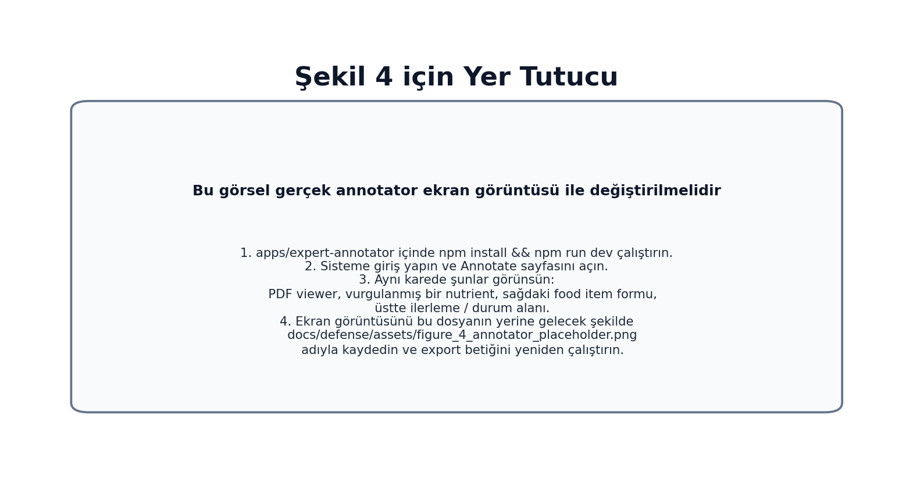

# YAZILIM MÜHENDİSLİĞİ UYGULAMASI-I
## ARASINAV RAPORU

### OpenNutri: Bilimsel Literatürden LLM Destekli Gıda Verisi Çıkarımı

**Öğrenciler:**

- 221229078 - Arciel Aliognis Baez Zamora
- 221229075 - Duc Huan Ngo
- 221229031 - Ayşegül Doğan

**Danışman:** Dr. Öğr. Üyesi Fatma Zehra Solak

**Sınav Tarihi:** [Danışman tarafından doldurulacaktır]

\newpage

# DÖNEM İÇİ YAPILAN ÇALIŞMALARIN ÖZETİ

Bu ara rapor, proje öneri formunda birinci dönem için tanımlanan ilk üç ana başlığın mevcut durumunu özetlemektedir:

- otomatik veri alma boru hattı,
- veritabanı ve orkestrasyon mimarisi,
- uzman anotasyon motoru.

Arasınav itibarıyla OpenNutri'nin çalışan çekirdeği kurulmuştur. Crawler, Europe PMC, OpenAlex, Semantic Scholar ve DergiPark kaynaklarından metadata toplar; adayları aşamalı uygunluk kontrolünden geçirir; yeterli bulunan PDF dosyalarını Supabase katmanına aktarır. Annotator arayüzü bu makaleleri PDF üzerinde açar, food item ve nutrient girdilerini kaydeder ve kullanıcı kararlarını sonraki taramaları etkileyen geri besleme sinyallerine dönüştürür.

Bu akışta üç teknik karar öne çıkmaktadır. İlk karar, PDF indirmeden önce güçlü ön eleme yapmaktır; böylece uzman önüne daha seçilmiş makaleler gelir. İkinci karar, Türkçe ve İngilizce literatürü ayrı hedef havuzlar olarak yönetmektir; bu sayede Türkçe çalışmalar sistemin doğrudan kapsama alanına girer. Üçüncü karar, uzman anotasyonunu sonraki crawler koşularını iyileştiren bir sinyale dönüştürmektir.

Birinci dönem maddeleri ile mevcut durumun ilişkisi Tablo 1'de özetlenmiştir.

| Öneri formu maddesi | Arasınav durumu | Somut çıktı |
| --- | --- | --- |
| 1. Otomatik Veri Alma Boru Hattı | Büyük ölçüde ilerletildi | Çok kaynaklı tarama, dil bazlı iş akışları, PDF edinme, doğrulama, Supabase'e yükleme |
| 2. Veritabanı ve Orkestrasyon Mimarisi | Büyük ölçüde ilerletildi | Ortak şema, RLS politikaları, depolama hattı, ETL ve arama kanıtı tabloları |
| 3. Uzman Anotasyon Motoru | Büyük ölçüde ilerletildi | PDF görüntüleme, nutrient highlight, dinamik food/nutrient girişi, test mode, global skip, olay kaydı |
| 4. Belge Segmentasyonu ve Temel Çıkarım Süreci | Sonraki aşama | Bu raporun odağı çalışan ilk üç başlıktır |

Tablo 2, çalışan sistemin ana parçalarını ve her parçanın projedeki rolünü özetlemektedir.

| Katman | Bu aşamada çalışan yetenekler | Projedeki rolü |
| --- | --- | --- |
| Crawler ve makale edinimi | Çok kaynaklı arama, çok aşamalı eleme, EN/TR iş akışları, DergiPark desteği, PDF doğrulama | Annotator kuyruğuna daha seçilmiş ve izlenebilir makaleler taşır |
| Backend ve veri modeli | Ortak veritabanı şeması, arama kanıtı kayıtları, anotasyon tabloları, RLS politikaları | UI, crawler ve geri besleme katmanını aynı veri sözleşmesi üzerinde birleştirir |
| Annotator ve kullanıcı iş akışı | PDF görüntüleme, highlight destekli veri girişi, dinamik food/nutrient formu, test mode, global skip | Uzman kullanıcının belge üzerinde kontrollü ve hızlı çalışmasını sağlar |
| Öğrenen geri besleme döngüsü | Event kaydı, global label kayıtları, geri besleme terimleri, query-batch sinyalleri | Kullanıcı kararlarını daha sonraki arama ve sıralamayı iyileştiren sinyallere dönüştürür |

Şekil 1, arasınav itibarıyla oluşan uçtan uca sistemi göstermektedir.

Şekil 1. OpenNutri'nin arasınav itibarıyla çalışan kapalı döngü mimarisi.

Arasınav çıktısı çalışan bir temel veri akışıdır. Makale edinimi, anotasyon kaydı ve geri besleme zinciri aynı altyapıda birleşmiştir.

\newpage

# PROJENİN AMACI ve ÖNEMİ

## Projenin Amacı

OpenNutri'nin amacı, bilimsel literatürde dağınık halde bulunan gıda bileşimi verilerini kaynak bağlantısını koruyarak yapısal veriye dönüştüren bir platform kurmaktır. Bu amaç için proje üç temel yetenek kurmaktadır:

- uygun makaleleri otomatik olarak bulmak ve sisteme taşımak,
- bu makaleleri uzmanların denetimli biçimde etiketlemesini sağlamak,
- oluşan etiketlerden yararlanarak sonraki tarama kararlarını daha isabetli hale getirmek.

Arasınav aşamasındaki odak, bu yapının çekirdek sürümünü ayağa kaldırmaktır. Mevcut çalışma; literatür tarama, uzman anotasyon, ortak veri modeli ve geri besleme zincirini aynı sistem içinde çalışır hale getirmektedir.

## Projenin Önemi

Bu projenin önemi, gıda bileşimi bilgisinin binlerce PDF içinde dağınık halde kalmasından doğar. Bilimsel veri vardır; fakat doğrudan sorgulanabilir, karşılaştırılabilir ve yeniden kullanılabilir kayıtlar halinde değildir. OpenNutri bu boşluğu, kaynak bağlantısını koruyan yapısal kayıtlar üreterek hedeflemektedir.

Bu ihtiyaç Türkçe literatürde özellikle görünürdür. Türkiye'de yayımlanan birçok çalışma DergiPark ve benzeri arşivlerde bulunur; ancak bu çalışmaların verileri uluslararası standart veri tabanlarına düzenli biçimde girmez. Sonuç olarak yerel ürünler, yerel çeşitler ve Türkçe yayınlar dijital gıda veri altyapılarında yeterince temsil edilmez. EN/TR iş akışlarının ayrılması bu nedenle doğrudan kapsam belirleyen bir karardır.

Projenin ikinci önemli yönü uzman zamanını korumasıdır. Uzman anotasyonu pahalı ve sınırlı bir kaynaktır. Bu nedenle OpenNutri makale bulma, ön eleme, PDF doğrulama ve kullanıcı geri beslemesini aynı zincirde birleştirir. Uzman kullanıcıya daha güçlü adaylar gelir; kullanıcı kararları da bir sonraki koşulda makale seçimini iyileştirir.

Uzun vadede bu yaklaşım araştırmacılar, sağlık teknolojileri, kamu kurumları ve ihracat odaklı üreticiler için yerli veri altyapısı oluşturabilir. Arasınav itibarıyla bu hedefin teknik zemini kurulmuştur.

\newpage

# KAYNAK ARAŞTIRMASI

Kaynak araştırmasında hem gıda verisi standartları hem de bilimsel makale işleme araçları birlikte incelenmiştir. Akademik makalelerin yanında veri tabanları, açık erişim arşivleri, ontolojiler ve kullanılan yazılım ekosistemi değerlendirilmiştir.

## 1. Gıda verisi ve referans sözlükleri

OpenNutri'nin veri modeli serbest metin etiketleri yerine ortak sözlük mantığı üzerine kurulmuştur. FoodData Central [1] ve FAO/INFOODS eşleme yaklaşımı [2] incelenerek canonical food ve canonical nutrient kavramları ayrı tablolarda ele alınmıştır. Bu yaklaşım, anotasyon ve literatür tarama süreçlerinde ortak bir sözlük kullanımını desteklemektedir.

FoodOn [3] gibi ontoloji tabanlı çalışmalar gıda adlarının standartlaştırılması açısından önemlidir. Bu tür ontolojiler, farklı kaynaklarda geçen gıda adlarını ortak kavramlar altında toplama ihtiyacını açık biçimde göstermektedir.

## 2. Bilimsel literatür kaynakları

PubMed Central [4] ve Europe PMC [5], açık erişimli biyomedikal ve yaşam bilimleri literatürüne düzenli erişim sağladıkları için temel dış kaynaklar olarak değerlendirilmiştir. DergiPark [6] ise özellikle Türkçe çalışmalara ulaşmak açısından önemlidir. Bu kaynakların birlikte değerlendirilmesi, uluslararası ve yerel literatürün aynı sistem içinde ama farklı sinyallerle ele alınması gereğini göstermektedir.

## 3. İnsan-döngülü öğrenme yaklaşımı

Human-in-the-loop yaklaşımı [7], bilimsel verilerin çıkarımı ve doğrulanmasında uzman kullanıcıyı sistemin aktif parçası olarak konumlandırır. Bu yaklaşım, uzman kararlarının yalnızca son etiket olarak değil, daha sonra yeniden kullanılabilecek geri besleme sinyalleri olarak ele alınmasını desteklemektedir.

## 4. PDF işleme ve kullanıcı arayüzü altyapısı

Makale içerikleri çoğunlukla PDF olarak dağıtıldığı için tarayıcı içinde PDF işleme kritik hale gelmiştir. PDF.js [8] tabanlı görüntüleme ve React [9] tabanlı kullanıcı arayüzü birlikte değerlendirilmiştir. Literatür anotasyonu bağlamında, PDF metin katmanındaki parçalanmış span yapısı nedeniyle yalnızca görüntüleme değil; seçim, vurgulama ve metin eşleme davranışları da önem kazanmaktadır.

## 5. Kullanılan platform bileşenleri

Supabase [10], kimlik doğrulama, satır düzeyi erişim kontrolü, dosya depolama ve istemci erişimini tek altyapıda birleştirdiği için değerlendirilmiştir. Bu tür platformlar, arayüz ve veri boru hattının aynı backend üzerinde çalıştığı sistemler için uygun temel sağlar.

Bu literatür ve platform incelemesi, ortak sözlük kullanımı, çok kaynaklı erişim, PDF üzerinde uzman anotasyonu ve insan-döngülü doğrulama yaklaşımının problem alanı için neden gerekli olduğunu göstermektedir.

\newpage

# MATERYAL VE METOT

## 1. Genel sistem yaklaşımı

OpenNutri'nin arasınav sürümü üç ana katmandan oluşmaktadır:

- kullanıcıya görünen annotator arayüzü,
- ortak backend/veri modeli,
- çok kaynaklı crawler ve geri besleme katmanı.

Arasınav sürümünde sistemi belirleyen dört mühendislik tercihi vardır: makale bulma ile PDF edinimini ayırmak, ortak sözlük ve ortak veritabanı kullanmak, anotasyonu dinamik satır modeliyle kurmak ve kullanıcı kararlarını olay tabanlı geri besleme olarak saklamak. Aşağıdaki alt bölümler araç listesinden çok bu yapının nasıl çalıştığını açıklamaktadır.

Bu katmanların etkileşimi Şekil 1'de gösterilmişti. Şekil 2 ise bu akışın veri modeli ve geri besleme ilişkilerini daha ayrıntılı göstermektedir.

Şekil 2. Arasınav sürümünde anotasyon, olay kaydı ve crawler geri beslemesinin veri modeli içindeki ilişkisi.

## 2. Kullanılan materyaller

Bu sürüm iki bağlı teknik küme üzerine kuruludur. Kullanıcı tarafında React 19 + Vite tabanlı web arayüzü, PDF.js ve react-pdf ile birlikte kullanılmış; böylece PDF görüntüleme, highlight ve form temelli anotasyon aynı çalışma ekranında toplanmıştır. Backend tarafında Supabase'in kimlik doğrulama, PostgreSQL ve dosya depolama bileşenleri birlikte değerlendirilmiştir.

Veri edinme ve geri besleme katmanı Python ile yürütülmektedir. Makale kaynakları olarak Europe PMC, PubMed Central, OpenAlex, Semantic Scholar ve DergiPark kullanılmış; referans veri kaynağı olarak USDA FoodData Central [1] seçilmiştir. Metadata düzeyindeki anlamsal uygunluk için sentence-transformers tabanlı İngilizce + çok dilli embedding yapısı tercih edilmiştir.

## 3. Backend ve veri modeli yöntemi

Backend tarafındaki temel karar, tüm sistemi tek bir ortak veri modeli etrafında toplamak olmuştur. Bu model dört ana parçadan oluşur: ortak gıda ve nutrient sözlüğü, sisteme alınan makaleler ve arama kanıtları, uzman anotasyon verisi ve kullanıcı kararlarını geri besleme olarak saklayan olay kayıtları.

Bu yapı arayüzü, crawler'ı ve geri besleme mantığını aynı veri modeli üzerinde birleştirir. Kullanıcı arayüzünde seçilen gıda ve nutrient adları ile crawler tarafında kullanılan terimler aynı referans sözlüğe dayanır. Bir makalenin sisteme giriş kaydı ile kullanıcı anotasyonları da aynı makale kaydı etrafında tutulur.

Şekil 3, aktif Supabase şemasından türetilmiş, sadeleştirilmiş bir veritabanı özeti sunmaktadır.

Şekil 3. Arasınav sürümündeki temel veritabanı yapısının, projeyi anlamayı kolaylaştıracak dört sorumluluk alanı altında özetlenmiş görünümü. Şema, aktif Supabase şemasından sadeleştirilerek hazırlanmıştır.

Backend güvenliği için satır düzeyi güvenlik (RLS) kullanılmıştır. Kullanıcılar kendi anotasyonlarını yönetebilirken sistem servis rolü crawler yüklemeleri, ETL ve bakım işlemleri için geniş yetkiye sahiptir. Bu, çok kullanıcılı yapı için gerekli temel güvenlik önlemidir.

## 4. Annotator arayüzü yöntemi

Annotator arayüzü, uzman kullanıcının bir makaleyi okuyup aynı anda yapılandırılmış veri girebildiği çalışma ekranı olarak tasarlanmıştır. Kullanıcı sisteme alınmış makaleyi açar, varsa önceki kaydını görür ve çalışmasına kaldığı yerden devam eder.

Arayüz iki ana prensiple tasarlanmıştır. Kullanıcı gerektiği kadar food item ve her food item altında gerektiği kadar nutrient değeri ekleyebilir. PDF görüntüleme ile form aynı çalışma ekranında birleşir; kullanıcı belgeyi okurken ilgili nutrient ifadelerini görüp daha hızlı veri girişi yapabilir. Bu yapı uzman kullanıcıya belge üzerinden doğrulama yapan aktif bir rol verir.

Bu bölümde özellikle üç davranış önemlidir:

- `test mode` ile gerçek veritabanına yazmadan tam iş akışının güvenli biçimde denenebilmesi,
- `global skip` ile bir makalenin tüm kullanıcılar için veri içermediğinin işaretlenmesi ve kısa süreli geri alma akışı,
- boş placeholder kartların kaydedilen toplamları etkilemesini önlemek için yalnızca geçerli food item'ların sayılması.

Şekil 4, annotator arayüzünün nihai ekran görüntüsü için yer tutucudur.

Şekil 4. Nihai teslimden önce bu görsel, çalışan annotator ekranının gerçek ekran görüntüsü ile değiştirilmelidir. Görselde PDF viewer, vurgulanmış nutrient örneği, food item formu ve ilerleme alanı aynı karede görünmelidir.

## 5. Crawler, filtreleme ve edinme yöntemi

Crawler tarafı kademeli seçim yapan bir boru hattı olarak tasarlanmıştır. Temel yaklaşım üç aşamadan oluşur:

- **Search:** Europe PMC, OpenAlex, Semantic Scholar ve DergiPark gibi kaynaklardan metadata düzeyinde aday bulma
- **Filter:** Başlık ve özet üzerinde `search gate` olarak adlandırılan ilk uygunluk eşiğini ve `metadata filter` olarak adlandırılan ayrıntılı uygunluk süzgecini uygulama
- **Acquisition:** Ancak yeterince iyi bulunan adaylar için PDF indirme ve tam metin doğrulama

Bu ayrım, crawler tarafındaki en kritik verimlilik kararlarından biridir. Tüm adayların PDF'ini indirmek yerine önce metadata düzeyinde ön eleme yapılır. Böylece tam metin aşamasına daha az sayıda ama daha güçlü aday geçer.

Filtreleme mantığı üç ana sinyal grubuna dayanır: konu ile ilişkili kelime ve birim ipuçları, semantik benzerlik/embedding uygunluğu ve önceki kullanıcı etiketlerinden öğrenilen geri besleme sinyalleri.

Crawler tarafında iki yetenek belirleyicidir: İngilizce ve Türkçe literatür için ayrı hedef havuzların yönetilmesi ve geri beslemenin `query batch`, yani aynı sorgu bileşimiyle yürütülen sınırlı arama partileri düzeyinde de değerlendirilmesi.

Şekil 5, crawler hattının aşamalı akışından üretilen sayısal özeti göstermektedir.

Şekil 5. Temsili bir Türkçe canlı koşunun manifest özetinden türetilen aşama sayıları.

Türkçe kaynaklar için DergiPark entegrasyonu yeniden ele alınmıştır. Eski geniş ve kontrolsüz tarama mantığı yerine dergi ve sayı bazında yenilenebilir yerel indeks dosyaları kullanılmaya başlanmıştır. Bu yöntem, özellikle Türkçe literatürde kaynak kalitesini ve izlenebilirliği artırmaktadır.

## 6. Feedback ve paper-stock yenileme yöntemi

Geri besleme güncelleme betiği, kullanıcı kararlarını zaman sıralı tutan `event log` kayıtlarından öğretici sinyaller üretir. Anlamlı veri kaydedilen makaleler olumlu örnek, açık biçimde veri içermeyen veya tekrarlı biçimde atlanan makaleler olumsuz örnek olarak değerlendirilir. Çelişkili durumlar öğrenme dışında bırakılır.

Kullanıcı kararı, sonraki crawler koşularında kullanılan yumuşak puanlama sinyalidir.

Son kullanıcıya yeterli makale kalmadığında makale stoğunu yenileyen betik devreye girmektedir. Bu betik mevcut EN/TR makale sayılarını kontrol etmekte, gerekiyorsa geri beslemeyi güncellemekte, DergiPark indeksini yenilemekte, crawler'ı çalıştırmakta ve sonuçları Supabase'e yüklemektedir. Böylece anotasyon arayüzü ile veri toplama hattı arasında operasyonel bir bağ kurulmuştur.

## 7. Arasınav kapsam sınırı

Bu rapor, çalışan ilk üç dönem hedefi ile onları destekleyen veri ve geri besleme altyapısına odaklanmaktadır. Belge segmentasyonu ve LLM tabanlı çıkarım süreci ikinci döneme bırakılmıştır.

Annotator ekran görüntüsü bu raporda yer tutucu olarak bırakılmıştır. Nihai teslimden önce en güncel arayüz görüntüsü eklenmelidir.

\newpage

# KAYNAKLAR

1. U.S. Department of Agriculture. *FoodData Central*. Erişim adresi: https://fdc.nal.usda.gov/ (Erişim tarihi: 02.04.2026).
2. FAO/INFOODS. *Guidelines for Food Matching*. Rome: Food and Agriculture Organization of the United Nations; 2012.
3. Dooley DM, Griffiths EJ, Gosal GS, et al. FoodOn: a harmonized food ontology to increase global food traceability, quality control and data integration. *npj Science of Food*. 2018;2(1):23.
4. National Center for Biotechnology Information. *PubMed Central (PMC)*. Erişim adresi: https://pmc.ncbi.nlm.nih.gov/ (Erişim tarihi: 02.04.2026).
5. Europe PMC. *Europe PMC*. Erişim adresi: https://europepmc.org/ (Erişim tarihi: 02.04.2026).
6. DergiPark Akademik. *DergiPark Akademik*. Erişim adresi: https://dergipark.org.tr/ (Erişim tarihi: 02.04.2026).
7. Monarch RM. *Human-in-the-Loop Machine Learning*. Manning Publications; 2021.
8. Mozilla. *PDF.js*. Erişim adresi: https://mozilla.github.io/pdf.js/ (Erişim tarihi: 02.04.2026).
9. React. *React Documentation*. Erişim adresi: https://react.dev/ (Erişim tarihi: 02.04.2026).
10. Supabase. *Supabase Documentation*. Erişim adresi: https://supabase.com/docs (Erişim tarihi: 02.04.2026).
