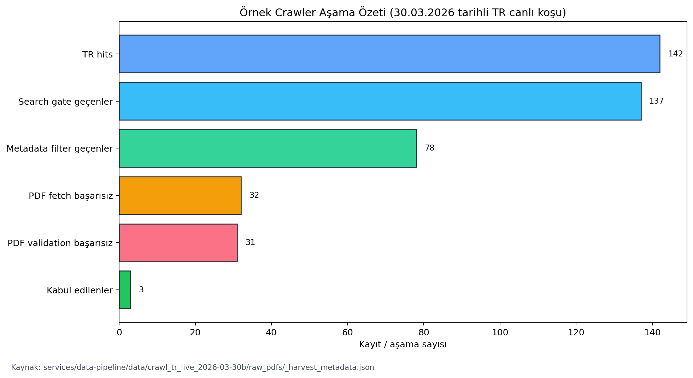

# YAZILIM MÜHENDİSLİĞİ UYGULAMASI-I
## ARASINAV RAPORU

### OpenNutri: Bilimsel Literatürden LLM Destekli Gıda Verisi Çıkarımı

**Öğrenciler:**

- 221229078 - Arciel Aliognis Baez Zamora
- 221229075 - Duc Huan Ngo
- 221229031 - Ayşegül Doğan

**Danışman:** Dr. Öğr. Üyesi Fatma Zehra Solak

**Sınav Tarihi:** [Danışman tarafından doldurulacaktır]

\newpage

# DÖNEM İÇİ YAPILAN ÇALIŞMALARIN ÖZETİ

Bu ara rapor, proje öneri formunda birinci dönem için tanımlanan ilk üç ana başlığın mevcut durumunu özetlemektedir:

- otomatik veri alma boru hattı,
- veritabanı ve orkestrasyon mimarisi,
- uzman anotasyon motoru.

Arasınav itibarıyla ekip, projenin yalnızca teorik tasarımını değil, birlikte çalışan gerçek bir sistem çekirdeğini ortaya çıkarmıştır. Mevcut durumda OpenNutri; bilimsel kaynaklardan aday makale bulabilen, bunları çok aşamalı olarak filtreleyebilen, uygun PDF dosyalarını sisteme aktarabilen, uzman kullanıcının bu makaleler üzerinde yapılandırılmış anotasyon yapmasını sağlayan ve oluşan etiketleri daha sonraki tarama kararlarına geri besleme olarak kullanabilen bir altyapıya sahiptir.

Bu çıktıların en önemli özelliği, birbirinden kopuk modüller olarak değil, ortak veri modeli etrafında birleşmiş tek bir akış olarak çalışmasıdır. Crawler tarafında bulunan makaleler Supabase tabanlı depolama ve veritabanı katmanına aktarılmakta, annotator arayüzü bu makaleleri kullanıcıya sunmakta, kullanıcı işlemlerinden oluşan etiket olayları sistemde kayıt altına alınmakta ve bu etiketler daha sonra `feedback/update_terms.py` üzerinden crawler sorgularını ve sıralama puanlarını iyileştiren yeni geri besleme terimlerine dönüştürülmektedir.

Birinci dönem maddeleri ile mevcut durumun ilişkisi Tablo 1'de özetlenmiştir.

| Öneri formu maddesi | Arasınav durumu | Somut çıktı |
| --- | --- | --- |
| 1. Otomatik Veri Alma Boru Hattı | Büyük ölçüde ilerletildi | Çok kaynaklı tarama, dil bazlı iş akışları, PDF edinme, doğrulama, Supabase'e yükleme |
| 2. Veritabanı ve Orkestrasyon Mimarisi | Büyük ölçüde ilerletildi | Ortak şema, RLS politikaları, depolama hattı, ETL ve arama kanıtı tabloları |
| 3. Uzman Anotasyon Motoru | Büyük ölçüde ilerletildi | PDF görüntüleme, nutrient highlight, dinamik food/nutrient girişi, test mode, global skip, olay kaydı |
| 4. Belge Segmentasyonu ve Temel Çıkarım Süreci | Bu rapor kapsamı dışında | Üretim düzeyinde tamamlanmış bir çıkarım hattı henüz sunulmamaktadır |

Sistem düzeyinde bakıldığında dönem içinde yapılan çalışmalar üç alt eksende yoğunlaşmıştır.

İlk eksen veri toplama ve aday makale havuzunun kurulmasıdır. Başlangıçta Europe PMC merkezli ilerleyen crawler hattı, daha sonra kaynak bağımsız bir `Search -> Filter -> Acquisition` yapısına dönüştürülmüştür. Böylece bir makale daha PDF indirilmeden önce başlık, özet, dil, kaynak önceliği, besin/nutrient eşleşmeleri, ölçü birimi sinyalleri, embedding benzerliği ve geri besleme terimleri gibi göstergelerle değerlendirilmeye başlanmıştır. Bu yaklaşım, gereksiz PDF indirmelerini azaltmış ve anotatör kuyruğuna daha seçilmiş örneklerin düşmesini sağlamıştır.

İkinci eksen ortak backend ve veri modelidir. `papers`, `annotations`, `food_items`, `annotation_nutrient_values`, `paper_label_events`, `paper_global_labels`, `paper_search_hits`, `paper_search_batches` ve `paper_search_batch_hits` tabloları birlikte ele alındığında sistem yalnızca son kullanıcı verisini değil, aynı zamanda makaleye nasıl ulaşıldığını ve neden kabul ya da reddedildiğini de izlenebilir biçimde saklamaktadır. Bu karar, hem öğretim elemanının projeyi değerlendirirken sistemin olgunluğunu anlamasını kolaylaştırmakta hem de gelecekte deneysel karşılaştırmaların yapılabilmesi için gerekli altyapıyı oluşturmaktadır.

Üçüncü eksen uzman anotasyon arayüzüdür. React/Vite tabanlı annotator arayüzü artık sadece basit bir form olmaktan çıkmış; PDF görüntüleme, nutrient terimlerini metin katmanında vurgulama, vurgudan hızlı nutrient ekleme, food ve nutrient aramasında sıralamalı eşleştirme, test mode, global "definitely no data" akışı ve kullanıcı işlem olaylarını kaydetme gibi davranışları içeren gerçek bir çalışma alanına dönüşmüştür. Özellikle `Annotate.jsx`, `PdfViewer.jsx` ve `PdfTextScanner.js` dosyalarında yapılan geliştirmeler, projenin kullanıcıya görünen tarafının araştırma prototipi seviyesinden kullanılabilir araç seviyesine taşındığını göstermektedir.

Ayrıca dönem boyunca sadece yeni özellik eklenmemiş, kalite ve tutarlılık düzeltmeleri de yapılmıştır. Örneğin boş food kartlarının sayım bozukluğu üretmemesi için yalnızca geçerli food item'ların kaydedilmesi sağlanmış; `paper_label_events` içindeki `food_item_count` ve `nutrient_value_count` alanları gerçek kullanıcı çıktısını daha doğru yansıtacak hale getirilmiştir. Benzer şekilde crawler tarafında eski `seen_ids` mantığı bırakılarak kararların `paper_states` üzerinden yönetilmesi, denemelerin daha kontrol edilebilir ve tekrarlanabilir olmasına katkı vermiştir.

Handoff sonrasında depoya yansıyan yüksek etkili gelişmeler Tablo 2'de verilmiştir.

| Tarih | Yüksek etkili gelişme | Projeye etkisi |
| --- | --- | --- |
| 20.03.2026 | Kümülatif ve alan-duyarlı soft feedback öğrenmesi | Etiketlerden üretilen terimlerin crawler puanlarına geri dönmesi sağlandı |
| 21.03.2026 | İngilizce ve Türkçe iş akışlarının ayrılması | EN/TR kaynaklar aynı havuzda karışmak yerine dil bazlı ayrı hedeflerle yönetilmeye başlandı |
| 22.03.2026 | `Search -> Filter -> Acquisition` refaktörü ve arama kanıtı tabloları | PDF edinmeden önce metadata bazlı eleme ve sorgu kanıtı saklama mümkün oldu |
| 30.03.2026 | Annotator sayım düzeltmesi ve canonical hit deduplikasyonu | UI kayıt kalitesi ve crawler kanıt tablolarının bütünlüğü arttı |
| 30.03.2026 | Türkçe crawl kotaları, metadata-only hit saklama, DergiPark indeks yenileme | Özellikle Türkçe literatür için kontrollü ve izlenebilir veri toplama akışı kuruldu |
| 30.03.2026 | Query-batch feedback ve search-gate batch accounting | Hangi sorgu partilerinin daha verimli olduğu ölçülebilir hale geldi |
| 30.03.2026 | Hard-negative veto mantığının kaldırılması | Crawler kararları sert veto yerine yumuşak ceza mantığıyla daha dengeli hale getirildi |

Şekil 1, arasınav itibarıyla oluşan uçtan uca sistemi göstermektedir.

Şekil 1. OpenNutri'nin arasınav itibarıyla çalışan kapalı döngü mimarisi.

Bu noktada özellikle vurgulanması gereken husus şudur: proje henüz öneri formundaki bütün hedefleri tamamlamamıştır; ancak ilk üç hedef için yalnızca hazırlık değil, gerçek çalışan bileşenler geliştirilmiştir. Bu nedenle mevcut aşama, "tasarım dökümanı" ile "tamamlanmış ürün" arasındaki ara bir nokta değil, sistemin çekirdek altyapısının fiilen çalıştığı erken üretim aşaması olarak değerlendirilebilir.

\newpage

# PROJENİN AMACI ve ÖNEMİ

## Projenin Amacı

OpenNutri'nin amacı, bilimsel literatürde dağınık halde bulunan gıda bileşimi verilerini insan uzmanlığını sistem dışına itmeden, aksine uzman geri bildirimini merkeze alarak dijitalleştiren bir platform geliştirmektir. Proje bu amacı gerçekleştirmek için üç temel yeteneği aynı anda kurmayı hedeflemektedir:

- uygun makaleleri otomatik olarak bulmak ve sisteme taşımak,
- bu makaleleri uzmanların denetimli biçimde etiketlemesini sağlamak,
- oluşan etiketlerden yararlanarak sonraki tarama kararlarını daha isabetli hale getirmek.

Arasınav aşamasında amaç, özellikle ilk dönem hedeflerine uygun biçimde bu üç yeteneğin çekirdek sürümünü ayağa kaldırmaktır. Buna göre mevcut çalışma, doğrudan LLM tabanlı tam çıkarım sistemini tamamlamaktan ziyade, o sistemi daha sonra güvenilir biçimde eğitip doğrulayabilecek veri ve kullanıcı altyapısını kurmaya odaklanmıştır.

## Projenin Önemi

Projenin önemi üç düzeyde ortaya çıkmaktadır.

Birinci düzey veri erişimi problemidir. Gıda bileşimiyle ilgili bilimsel çalışmalar çoğunlukla PDF biçiminde, farklı dergi altyapılarında ve çoğu zaman standart bir veri çıkış formatı olmadan yayımlanmaktadır. Bu nedenle bilgi vardır, ancak doğrudan sorgulanabilir veri olarak kullanılamaz. OpenNutri bu boşluğu doldurmayı hedeflemektedir.

İkinci düzey insan emeğinin verimli kullanılmasıdır. Uzman anotasyonu pahalı ve sınırlı bir kaynaktır. Eğer sisteme yanlış makaleler gelirse uzman zamanı boşa harcanır. Bu nedenle proje yalnızca bir arayüz yapmakla kalmamakta, crawler ve geri besleme katmanı ile uzman önüne daha anlamlı adaylar getirmeye çalışmaktadır. Arasınav itibarıyla geliştirilen search gate, metadata filter, PDF doğrulama ve global skip mantığı tam olarak bu ihtiyaca cevap vermektedir.

Üçüncü düzey Türkçe literatürün görünürlüğüdür. Proje öneri formunda açıkça PubMed ve DergiPark kaynakları hedeflenmiştir. Bu seçim tesadüf değildir. PubMed Central uluslararası açık erişim literatüre erişim sağlarken, DergiPark Türkiye'de yayımlanan birçok çalışmaya erişim sağlar. Dil bazlı EN/TR iş akışlarına geçilmiş olması, Türkçe çalışmaları yalnızca yan ürün olarak değil, ayrı bir hedef havuz olarak ele alma kararı açısından önemlidir.

Teknik açıdan bakıldığında projenin önemi yalnızca tek bir algoritma kullanmasından gelmez. OpenNutri; normalize edilmiş veri modeli, çok kaynaklı tarama, katmanlı filtreleme, PDF doğrulama, kullanıcı olay kaydı ve soft feedback öğrenmesini bir araya getirerek klasik bir CRUD uygulamasından daha ileri bir yapı kurmaktadır. Bu bütünleşik yaklaşım, ileride eklenecek belge segmentasyonu ve LLM tabanlı çıkarım katmanının sağlam bir temel üzerinde gelişmesini sağlayacaktır.

\newpage

# KAYNAK ARAŞTIRMASI

Proje tasarlanırken hem gıda verisi standartları hem de bilimsel makale işleme araçları birlikte incelenmiştir. Kaynak araştırması yalnızca akademik makalelerden oluşmamış; veri tabanları, açık erişim makale arşivleri, ontolojiler ve kullanılan yazılım ekosistemi de değerlendirilmiştir.

## 1. Gıda verisi ve referans sözlükleri

OpenNutri'nin veri modeli doğrudan serbest metin etiketleri üzerine kurulmamıştır. FoodData Central [1] ve FAO/INFOODS eşleme yaklaşımı [2] incelenerek canonical food ve canonical nutrient kavramları ayrı tablolar halinde modellenmiştir. Bu yaklaşım sayesinde kullanıcı arayüzünde görülen food ve nutrient seçimleri, daha sonra crawler terim üretiminde ve potansiyel LLM çıkarımının doğrulanmasında yeniden kullanılabilecek ortak bir sözlüğe bağlanmıştır.

FoodOn [3] gibi ontoloji tabanlı çalışmalar da özellikle gıda adlarının standartlaştırılması açısından önemlidir. Projenin mevcut sürümünde tam ontoloji entegrasyonu bulunmamaktadır; ancak `entities` ve `entity_aliases` yapısının seçilmesinde benzer bir standartlaştırma ihtiyacı gözetilmiştir.

## 2. Bilimsel literatür kaynakları

PubMed Central [4] ve Europe PMC [5], açık erişimli biyomedikal ve yaşam bilimleri literatürüne düzenli erişim sağladıkları için crawler hattının temel dış kaynakları olarak değerlendirilmiştir. DergiPark [6] ise özellikle Türkçe çalışmalara ulaşmak amacıyla projeye dahil edilmiştir. Arasınav döneminde DergiPark entegrasyonu basit bir genel arama mantığından çıkarılıp dergi-sayı-makale düzeyinde yenilenebilir yerel indeks mantığına taşınmıştır. Bu değişiklik, Türkçe kaynakların daha kontrollü taranmasını sağlamıştır.

## 3. İnsan-döngülü öğrenme yaklaşımı

Projede tüm kararların doğrudan otomasyona bırakılmaması bilinçli bir tercihtir. Human-in-the-loop yaklaşımı [7], özellikle bilimsel verilerin çıkarımı ve doğrulanmasında uzman kullanıcıyı sistemin aktif parçası haline getirmeyi önerir. OpenNutri'de bu fikir, annotator arayüzü ve `paper_label_events` ile somut hale gelmiştir. Kullanıcıların `draft`, `done`, `skipped` ve global `definitely_no_data` işlemleri sadece arayüz hareketi olarak kalmamakta; daha sonra crawler'a geri besleme olarak dönmektedir.

## 4. PDF işleme ve kullanıcı arayüzü altyapısı

Makale içerikleri çoğunlukla PDF olarak dağıtıldığı için tarayıcı içinde PDF işleme kritik hale gelmiştir. PDF.js [8] tabanlı görüntüleme ve React [9] tabanlı kullanıcı arayüzü birlikte değerlendirilmiştir. Ancak PDF işleme yalnızca görüntülemeyle sınırlı kalmamış, PDF metin katmanındaki parçalanmış span yapısı nedeniyle nutrient highlight özelliği için ek tarama ve çakışma çözüm mantıkları geliştirilmiştir. Bu durum, literatür tarama araçları ile klasik web formu arasındaki farkı açık biçimde göstermektedir.

## 5. Kullanılan platform bileşenleri

Supabase [10], proje için sadece bir veritabanı değil; kimlik doğrulama, satır düzeyi erişim kontrolü, dosya depolama ve istemci erişimi gibi ihtiyaçları tek bir altyapıda birleştiren platform olarak değerlendirilmiştir. Arasınav itibarıyla hem annotator hem de veri boru hattı aynı backend katmanını paylaşmaktadır. Bu tercih, veri tutarlılığı ve hızlı prototipleme açısından anlamlı bulunmuştur.

Kaynak araştırmasının çıktısı olarak şu mühendislik kararları alınmıştır:

- makale bulma ile PDF indirmeyi aynı adımda yapmamak,
- kullanıcı arayüzünü statik nutrient kolonları yerine dinamik satır modeliyle tasarlamak,
- etiketleri yalnızca son durum olarak değil, olay geçmişi olarak saklamak,
- Türkçe ve İngilizce kaynakları aynı mantık altında ama ayrı hedeflerle yönetmek,
- feedback bilgisini sert veto yerine yumuşak puan olarak kullanmak.

Bu kararların tamamı mevcut kod tabanında uygulanmış durumdadır ve projeyi salt teorik tasarımdan çıkarıp gerçek bir sistem davranışına taşımaktadır.

\newpage

# MATERYAL VE METOT

## 1. Genel sistem yaklaşımı

OpenNutri'nin arasınav sürümü üç ana katmandan oluşmaktadır:

- kullanıcıya görünen annotator arayüzü,
- ortak backend/veri modeli,
- çok kaynaklı crawler ve geri besleme katmanı.

Bu katmanların etkileşimi Şekil 1'de gösterilmişti. Şekil 2 ise bu akışın veri modeli ve geri besleme ilişkilerini daha ayrıntılı göstermektedir.

Şekil 2. Arasınav sürümünde anotasyon, olay kaydı ve crawler geri beslemesinin veri modeli içindeki ilişkisi.

## 2. Kullanılan materyaller

Projede kullanılan temel materyaller aşağıdaki gibidir:

- **Frontend çerçevesi:** React 19 + Vite
- **Backend ve depolama:** Supabase Auth, PostgreSQL, Storage
- **PDF işleme:** `react-pdf` ve PDF.js
- **Veri boru hattı dili:** Python
- **Referans veri kaynağı:** USDA FoodData Central [1]
- **Makale kaynakları:** Europe PMC [5], PubMed Central [4], OpenAlex, Semantic Scholar, DergiPark [6]
- **Embedding katmanı:** `sentence-transformers` tabanlı İngilizce + çok dilli ikili gömme yapısı

Bu bileşenler, gereksinimlere göre iki tarafta kullanılmıştır: kullanıcı iş akışını yöneten web uygulaması ve makale havuzunu besleyen veri boru hattı.

## 3. Backend ve veri modeli yöntemi

Backend tarafında önce normalize edilmiş bir referans veri şeması kurulmuştur. `entities`, `entity_aliases`, `master_nutrients`, `sources` ve `claims` tabloları gıda ve nutrient sözlüğünü temsil etmektedir. Bu yapı, doğrudan kullanıcı anotasyonundan bağımsız tutulmuştur. Böylece hem frontend autocomplete bileşenleri hem de crawler terim üretimi aynı sözlüğü kullanabilmektedir.

Anotasyon tarafında ikinci bir ilişkisel katman kurulmuştur. `papers` tablosu sisteme aktarılmış makaleleri; `annotations` tablosu kullanıcı başına makale durumunu; `food_items` ve `annotation_nutrient_values` tabloları ise esnek gıda ve nutrient girişini tutmaktadır. Bu tasarımda özellikle sabit kolonlu besin paneli yerine dinamik satır yaklaşımı benimsenmiştir. Böylece bir makalede yalnızca proximate composition varken başka bir makalede vitamin veya mineral yoğunlukları da bulunabilmektedir.

Arasınav döneminde backend tarafında iki önemli genişleme yapılmıştır. Birincisi, `paper_label_events` ve `paper_global_labels` ile kullanıcı davranışının öğrenme amaçlı olay verisi olarak saklanmasıdır. İkincisi, `paper_search_hits`, `paper_search_batches` ve `paper_search_batch_hits` tabloları ile crawler'ın sadece kabul edilen makaleleri değil, makaleye giden arama kanıtını da saklamasıdır. Böylece gelecekte "hangi sorgu kombinasyonları daha verimli çalıştı?" sorusu veri tabanı üzerinden yanıtlanabilir hale gelmiştir.

Backend güvenliği için satır düzeyi güvenlik (RLS) kullanılmıştır. Kullanıcılar kendi anotasyonlarını yönetebilirken sistem servis rolü crawler yüklemeleri, ETL ve bakım işlemleri için geniş yetkiye sahiptir. Bu, çok kullanıcılı yapı için gerekli temel güvenlik önlemidir.

## 4. Annotator arayüzü yöntemi

Annotator arayüzünün merkezinde `Annotate.jsx` bulunmaktadır. Bu bileşen uygulama açıldığında makaleleri, kullanıcının önceki anotasyon durumlarını, nutrient referans listesini ve food kataloğunu yüklemektedir. Seçili makale değiştiğinde o makaleye ait önceki anotasyon geri çağrılmakta ve kullanıcı kaldığı yerden devam edebilmektedir.

Arayüzde gıda ve nutrient girişi için dinamik form yapısı kullanılmıştır. Her bir food item altında istenen sayıda nutrient satırı açılabilmektedir. `FoodAutocomplete.jsx` ve `NutrientAutocomplete.jsx` bileşenleri tam eşleşme, prefix eşleşmesi, token normalizasyonu ve alias değerlendirmesi ile sonuçları sıralamaktadır. Böylece kullanıcı yalnızca birebir veri tabanı adını bilmek zorunda kalmamaktadır.

PDF etkileşimi için `PdfViewer.jsx` ve `PdfTextScanner.js` birlikte çalışmaktadır. PDF.js tarafından üretilen text layer span'ları taranmakta, nutrient terimleri uygun yerlerde `<mark>` ile vurgulanmakta ve kullanıcı bu vurgulara tıklayarak hızlı nutrient ekleme popover'ını açabilmektedir. Bu özellik, arayüzün düz bir veri giriş formu olmaktan çıkıp belge üzerinde çalışan bir anotasyon aracı haline gelmesini sağlamaktadır.

Arasınav sürecinde arayüz tarafında üç önemli davranış eklenmiş veya iyileştirilmiştir:

- test mode ile gerçek veritabanına yazmadan güvenli deneme yapılabilmesi,
- global "definitely no data" işaretleme ve kısa süreli geri alma akışı,
- boş placeholder kartların yanlış `food_item_count` üretmemesi için yalnızca geçerli food item'ların sayılması.

Şekil 3, crawler hattının artık aşamalı ölçüm üretebildiğini göstermek amacıyla yerel bir örnek çalıştırmadan üretilmiştir.

Şekil 3. `2026-03-30` tarihli örnek Türkçe canlı koşunun manifest özetinden türetilen aşama sayıları. Bu şekil bir genel başarı benchmarkı değil, ölçülebilir pipeline davranışının oluştuğunu göstermek için eklenmiştir.

Arayüz ekranı için Şekil 4'te bir yer tutucu bırakılmıştır.

Şekil 4. Nihai teslimden önce bu görsel, çalışan annotator ekranının gerçek ekran görüntüsü ile değiştirilmelidir. En pratik yol, `docs/defense/assets/figure_4_annotator_placeholder.png` dosyasını gerçek ekran görüntüsü ile aynı ad altında değiştirip export betiğini yeniden çalıştırmaktır. Görselde PDF viewer, vurgulanmış nutrient örneği, food item formu ve ilerleme alanı aynı karede görünmelidir.

## 5. Crawler, filtreleme ve edinme yöntemi

Crawler tarafı tek adımlı bir arama betiği olarak tasarlanmamıştır. Arasınav itibarıyla kullanılan yaklaşım üç aşamalıdır:

- **Search:** Europe PMC, OpenAlex, Semantic Scholar ve DergiPark gibi kaynaklardan metadata düzeyinde aday bulma
- **Filter:** Başlık ve özet üzerinde search gate ve metadata filter uygulama
- **Acquisition:** Ancak yeterince iyi bulunan adaylar için PDF indirme ve tam metin doğrulama

Bu ayrım önemli bir mühendislik kararıdır. Çünkü tüm adayların PDF'ini indirmek hem pahalı hem de gereksizdir. Ön eleme sayesinde daha az sayıda ama daha güçlü aday tam metin aşamasına geçmektedir.

Filtreleme mantığında şu sinyaller birlikte kullanılmaktadır:

- food composition ve nutrient content odaklı ifade kalıpları,
- `mg/100g`, `g/100g` gibi birim sinyalleri,
- food ve nutrient terim vuruşları,
- sağlık sonucu ve klinik çalışma temalı negatif sinyaller,
- İngilizce ve çok dilli embedding benzerliği,
- kullanıcı etiketlerinden türetilen geri besleme terimleri,
- kaynak bazlı öncelikler ve sorgu partisi verimi.

Arasınav sürecinin sonuna doğru crawler iki önemli yönde genişletilmiştir. İlk olarak İngilizce ve Türkçe iş akışları ayrılmış, hedef kabul sayıları dil başına bağımsız yönetilmeye başlanmıştır. İkinci olarak `query-batch feedback` yaklaşımı eklenmiş, böylece yalnızca hangi kelimelerin faydalı olduğu değil, hangi sorgu partilerinin daha iyi etiket getirisi ürettiği de puanlanabilir hale gelmiştir.

Türkçe kaynaklar için DergiPark entegrasyonu yeniden ele alınmıştır. Eski geniş ve kontrolsüz tarama mantığı yerine dergi ve sayı bazında yenilenebilir yerel indeks dosyaları kullanılmaya başlanmıştır. Bu yöntem, özellikle Türkçe literatürde kaynak kalitesini ve izlenebilirliği artırmaktadır.

## 6. Feedback ve paper-stock yenileme yöntemi

`feedback/update_terms.py` betiği, kullanıcıların kaydettiği `paper_label_events` ve `paper_global_labels` verilerini okuyarak eğitim etiketleri üretmektedir. Mevcut mantık şu şekildedir:

- `draft` veya `done` durumunda, `has_data=true`, `food_item_count>0` ve `nutrient_value_count>0` ise olumlu örnek sayılır,
- global `definitely_no_data` ya da iki farklı kullanıcıdan gelen skip sinyali olumsuz örnek sayılır,
- çelişkili durumlar eğitimden hariç tutulur.

Bu örneklerden başlık ve başlık+özet düzeyinde n-gram terimleri çıkarılmakta, iyi/kötü dağılımları karşılaştırılarak sorgu ifadeleri, anchor ifadeler, ağırlıklı terimler, kaynak öncelikleri ve batch skorları üretilmektedir. Bu çıktı daha sonra crawler tarafından soft score olarak kullanılmaktadır. Yani sistem geri beslemeyi sert veto olarak değil, daha dengeli bir puanlama unsuru olarak ele almaktadır.

Son kullanıcıya yeterli makale kalmadığında `ensure_paper_stock.py` devreye girmektedir. Bu betik mevcut EN/TR makale sayılarını kontrol etmekte, gerekiyorsa geri beslemeyi güncellemekte, DergiPark indeksini yenilemekte, crawler'ı çalıştırmakta ve sonuçları Supabase'e yüklemektedir. Böylece anotasyon arayüzü ile veri toplama hattı arasında operasyonel bir bağ kurulmuştur.

## 7. Mevcut sınırlar

Arasınav itibarıyla proje öneri formundaki dördüncü madde olan belge segmentasyonu ve LLM tabanlı temel çıkarım süreci, tamamlanmış üretim hattı olarak sunulmamaktadır. Depoda bu yönde bazı araştırma ve prototip dosyaları bulunsa da, bu raporun kapsamı çalışan ilk üç dönem hedefi ile onları destekleyen veri/geri besleme altyapısıdır.

Benzer şekilde gerçek annotator ekran görüntüsü de bu raporda yer tutucu olarak bırakılmıştır. Bunun nedeni, ekran görüntüsünün teslim öncesinde en güncel arayüz haliyle alınmasının daha doğru olmasıdır.

\newpage

# KAYNAKLAR

1. U.S. Department of Agriculture. FoodData Central. https://fdc.nal.usda.gov/
2. FAO/INFOODS. Guidelines for Food Matching. Rome: Food and Agriculture Organization of the United Nations, 2012.
3. Dooley DM, Griffiths EJ, Gosal GS, et al. FoodOn: a harmonized food ontology to increase global food traceability, quality control and data integration. *npj Science of Food*. 2018;2(1):23.
4. National Center for Biotechnology Information. PubMed Central (PMC). https://pmc.ncbi.nlm.nih.gov/
5. Europe PMC. https://europepmc.org/
6. DergiPark Akademik. https://dergipark.org.tr/
7. Monarch RM. *Human-in-the-Loop Machine Learning*. Manning Publications; 2021.
8. Mozilla. PDF.js. https://mozilla.github.io/pdf.js/
9. React Documentation. https://react.dev/
10. Supabase Documentation. https://supabase.com/docs
